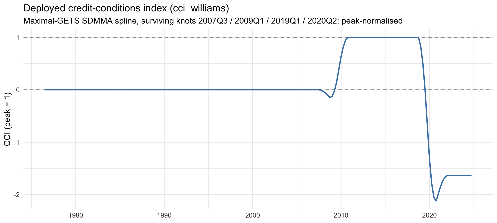
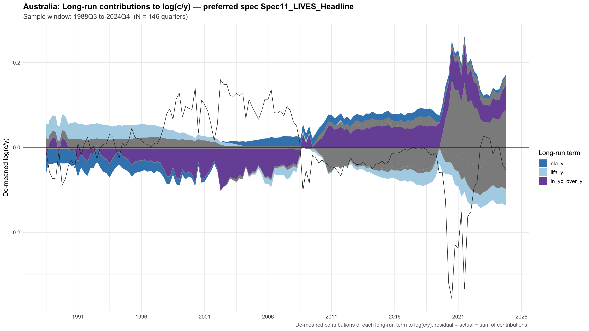

# Australian Household Consumption, Wealth and Credit Conditions: A Single-Equation LIVES Estimate

**David Stephan**

**JEL classification:** E21, E32, E51, D14
**Keywords:** household consumption, wealth effects, credit conditions, error-correction models, permanent income

---

## Abstract

We estimate the Muellbauer–Williams credit-conditioned ('LIVES') consumption function for Australia over 1988Q3–2026Q1, extending Williams (2010) and Muellbauer and Williams (2012) by eighteen years of post-crisis data and assembling a household-sector dataset back-extended to 1976Q3. Our central result is that the functional form of the equation, rather than the sample, the data vintage or the estimator, determines what a single equation can identify. In the canonical form there is no free-standing housing wealth effect: housing enters only through its interaction with a latent credit conditions index, so the housing propensity is zero when credit is tight and is unlocked as credit eases. Estimating that form recovers an error-correction speed of λ ≈ −0.25 on samples that control for the pandemic — close to Williams' −0.286 — together with significant, correctly signed marginal propensities to consume out of net liquid wealth (0.059) and illiquid financial wealth (0.034). A conventional constant-propensity error-correction model estimated on the same data delivers an equilibrium that disappears once the pandemic quarters are excluded. The LIVES structure therefore transfers to Australia; Williams' Australian calibrations do not, since imposing his permanent-income gearing collapses the error correction to zero. The individual credit channels remain weakly identified, which is why identification in this family of models comes from cross-equation restrictions rather than from any single equation.

---

## 1. Introduction

Australian household consumption raises a set of policy questions that the representative-agent workhorse, with its exogenous wealth process and frictionless credit access, is poorly equipped to answer. How sensitive is consumption to housing wealth at different points in the credit cycle, when households are or are not able to extract home equity? How much of the post-2008 moderation in consumption growth reflects the macroprudential tightening of 2014 and 2017, and how much post-crisis balance-sheet repair? And how should a central bank think about the wealth channel of monetary policy when most household wealth is housing wealth, mortgage debt is near historic highs relative to income, and the credit environment has shifted repeatedly since deregulation in the 1980s?

The framework designed for these questions is the Muellbauer–Williams latent interactive variable equation system, in the flow-of-funds tradition of Tobin and Dolde (1971) and Duca and Muellbauer (2013). It augments the credit-augmented life-cycle consumption function (Friedman 1957; Ando and Modigliani 1963) with three features. Wealth is disaggregated into net liquid assets, illiquid financial assets and housing assets, each entered as a ratio to annualised income and each carrying its own marginal propensity to consume (Backus and Purvis 1980). A latent credit conditions index (CCI) interacts with the long-run relationship, so that key channels are switched on only as credit eases. And the same latent index is identified *jointly* across a four-equation system — consumption, house prices, the mortgage stock and home equity withdrawal — under cross-equation restrictions estimated by full-information maximum likelihood (FIML). Williams (2010) applied this system to Australia over 1978–2008, producing the canonical Australian estimate. Eighteen further years of data now warrant a contemporary re-examination.

The theoretically load-bearing feature is how housing enters. In the canonical equation — Williams' (2010) equation (7), his Table 1, column 1 — **there is no classical housing wealth effect**. Housing wealth appears *only* through its interaction with credit conditions, as γ₁·CCI·(HA/4y). The housing marginal propensity to consume is therefore identically zero when credit is fully constrained and is unlocked as credit eases, reaching its maximum at the peak of the index. Illiquid financial and net liquid wealth, by contrast, enter as plain, credit-invariant propensities. This has an immediate empirical consequence: a specification that enters a standalone housing-wealth ratio is not the LIVES equation, and an insignificant standalone housing coefficient in such a specification is not evidence against a housing wealth effect, since the theory predicts that coefficient to be approximately zero in the absence of the interaction.

**The question this paper asks.** The credit-conditioned equation is, in its original form, a system. Applied researchers and forecasting units, however, overwhelmingly work with the single consumption equation, because the balance-sheet and house-price data needed for a full system are scarce and because a single equation is what fits inside a policy model. The question we pose is therefore not whether the credit-conditioned model holds in Australia, but the sharper one: *what can a single aggregate consumption equation, estimated on Australian data alone, identify about the credit-conditioned mechanism, and what must it leave to the system or to a longer sample?* The answer draws a reasonably clean line. The data identify the functional form and the adjustment mechanism; they do not identify the magnitudes of the individual credit channels.

**Contributions.** We make five contributions. First, we estimate the LIVES equation in its faithful form and show that the form, not the fit of any one regressor, is what identifies it. Entering housing only through the credit interaction, restoring the autonomous-consumption loading on the index, and combining equities and superannuation into a single illiquid-financial ratio yields a strongly identified error-correction structure. On the pandemic-controlled samples the speed of adjustment is λ ≈ −0.25, within about 14 per cent of Williams' −0.286, with correctly signed and significant propensities on net liquid and illiquid financial wealth. The conventional constant-propensity error-correction model, estimated on the same data, delivers an equilibrium that survives only because of the pandemic quarters.

Second, we establish that the LIVES *structure* transfers to Australia while Williams' Australian *calibrations* do not. Imposing his permanent-income gearing (ψ₀ = 0.20, ψ₁ = 0.93) and his illiquid-financial propensity (γ_IFA = 0.022) collapses the error correction to λ = −0.031 (t = −0.75), a result reproduced independently by a second calibration route. The mechanism is that the Australian data freely estimate a structural permanent-income gearing of order one, several times Williams' value, so imposing the lower value destroys the long-run fixed point. This also reconciles a Wald test that fails to reject Williams' joint calibration (Appendix E.1): the free estimates are too imprecise to reject his values, but low power is not the same as good fit.

Third, we diagnose why the individual credit channels cannot be recovered from one equation. The credit-interacted regressors are between 0.50 and 0.97 mutually correlated in absolute value on this sample, because each is approximately proportional to the same latent index; and the empirically selected index has no variation before 2007Q3, so the credit channels are identified off roughly seventy-five quarters rather than the nominal 151. This is the structural reason Williams identifies the credit channels through cross-equation FIML restrictions rather than within the consumption equation, and it implies that the routes to sharpening them are joint estimation and a longer sample, not further single-equation refinement.

Fourth, we assemble a household-sector dataset back-extended to 1976Q3 — using a long-run house price compilation, RBA monetary and credit aggregates, historical labour-force series, and documented wealth proxies anchored at 1988Q3 — and use it to test directly whether sample length is the binding constraint. It is not: refitting the disaggregated specification on the longer window moves the speed of adjustment about 12 per cent toward Williams but shrinks rather than sharpens the individual wealth channels.

Fifth, we run a structured robustness and placebo suite mirroring the Italian methodology of De Bonis, Liberati, Muellbauer and Rondinelli (2020), and report its negative results as findings. A freely estimated single equation permits diagnostics that imposed restrictions would suppress, and each negative here points toward the same conclusion: the literal Williams four-knot credit-conditions spline sits at the median of a random-knot placebo distribution; a two-equation seemingly-unrelated-regressions (SUR) estimate delivers negligible cross-equation residual correlation and no efficiency gain; the structural specifications lose to a random walk with drift at horizons beyond one quarter; no specification clears an Engle–Granger cointegration screen at MacKinnon critical values; and the headline permanent-income response is a property of a full-sample, non-causal measure that partly reverses under a real-time construction.

**Headline estimates.** The LIVES specification delivers a speed of adjustment tightly clustered at λ ≈ −0.25 across three pandemic-controlled treatments (−0.265, −0.241 and −0.235, with *t*-ratios of −4.9 to −7.7), against Williams' −0.286. The full-sample estimate of −0.423 is inflated by the pandemic quarters and we do not treat it as the identified value. The implied structural marginal propensity to consume is 0.059 (95 per cent interval [0.021, 0.098]) out of net liquid assets and 0.034 ([0.010, 0.058]) out of illiquid financial assets, the latter spanning Williams' calibrated 0.022. The housing-collateral channel is correctly signed but statistically insignificant, with an implied peak propensity of 0.0075 ([−0.009, 0.024]). Permanent income enters strongly, though its implied structural gearing of 1.0–1.2 exceeds the theoretical admissibility bound of about 0.95 — a tension we report rather than rescale away, and which we show is not an artefact of the crisis-period learning weight applied to the series.

**Structure.** Section 2 places the paper in three literatures. Section 3 sets out the model and argues, from its algebra, what one equation can and cannot separate. Section 4 documents the data. Section 5 fixes the empirical strategy: the specifications we lead with, the construction and placebo-testing of the credit conditions index, and the selection screens. Section 6 reports results, Section 7 the comparison with Williams, and Section 8 the robustness suite. Section 9 presents the long-run decomposition and the policy implications, including the nesting of our estimates in the Reserve Bank's MARTIN model. Section 10 concludes. Four appendices document the data construction, the full specification ladder, the coefficient matrix and the diagnostic battery.

---

## 2. Related literature

The paper sits at the intersection of three literatures: the credit-conditioned consumption tradition of Muellbauer and co-authors; the Australian empirical consumption literature, historically built on constant-propensity wealth effects; and a smaller body of work disciplining the measurement of permanent income.

### 2.1 Theory and the credit-conditioned form

The empirical model descends from the Davidson, Hendry, Srba and Yeo (1978) error-correction consumption function and the permanent-income hypothesis of Friedman (1957) and Hall (1978), with Engle and Granger (1987) supplying the cointegration framework and Hendry and Krolzig (2005) and Doornik (2009) the general-to-specific reduction that disciplines the short-run dynamics. A long line of work documents departures from strict permanent-income behaviour: Campbell and Mankiw (1989, 1991) find that roughly half of US consumption tracks current rather than permanent income; Carroll and Kimball (1996) establish the concavity of the consumption function under prudence; and Carroll (2001) and Deaton (1992) develop the buffer-stock interpretation that motivates the distinction between liquid and illiquid wealth. The empirical implication — that wealth components differing in liquidity, transactions costs and ownership concentration should carry different marginal propensities — is the cornerstone of the disaggregated specifications estimated below. In the credit-conditioned form the implication is sharpened: liquidity matters not only through a level distinction but through how each component interacts with the prevailing state of credit. Housing wealth is collateral whose consumability depends on the borrowing technology, and so enters only through the credit interaction.

Muellbauer (2007) integrated these strands. When credit is tight, housing collateralises borrowing only weakly and the down-payment hurdle dampens consumption; when credit is loose, housing wealth and consumption become tightly linked. Expressing this requires a credit conditions index entering the long-run relationship not as a single additive term but as a multiplicative shifter across several channels simultaneously. The framework was operationalised in a series of country studies. Aron, Duca, Muellbauer, Murata and Murphy (2012) estimate it jointly for Japan, the United Kingdom and the United States, finding positive long-run housing wealth effects where home equity withdrawal is institutionally available and a much smaller effect in Japan, where it is not — the cross-country pattern the credit-interaction form predicts. Duca, Muellbauer and Murphy (2010) apply the framework to the global financial crisis; Aron and Muellbauer (2013) to South Africa; Geiger, Muellbauer and Rupprecht (2016) to Germany. Duca and Muellbauer (2013) formalise the system logic, emphasising the joint determination of consumption, house prices, mortgage debt and home equity withdrawal under common factors and cross-equation sign restrictions.

Two single-equation national implementations frame this paper directly. De Bonis, Liberati, Muellbauer and Rondinelli (2020) estimate an Italian adaptation that imposes the restriction γ_LA + γ_LOANS = 0 (so that net liquid assets is the operative quantity), adopts a direct single-regression forecast of the discounted future-income aggregate as its permanent-income measure, applies the Drehmann, Juselius and Korinek (2017) amortisation adjustment to the real mortgage rate, and validates single-equation OLS against joint SUR. Chauvin and Muellbauer (2018) undertake a comparable French adaptation, with attention to the institutional features — limited home equity withdrawal, a large social housing sector — that shape the housing channel. Both take Williams' Australian work as a methodological precedent; the present paper closes the loop by applying the Italian methodology back to the Australian data on which the original estimation was performed. De Bonis, Liberati, Muellbauer and Rondinelli (2023) subsequently argue, on Italian data, that net worth is the wrong aggregate for explaining consumption precisely because its components carry different propensities — a direct motivation for the disaggregated treatment used here.

### 2.2 Australian evidence

The Australian application was developed in two companion papers. Williams (2009) focuses on the house-price equation and its identification under financial liberalisation, developing the spline-based credit conditions index from unobserved-components estimation (Koopman et al. 2000), anchoring it at four institutional turning points, and constructing the non-property income measure we replicate in Section 4. Williams (2010) estimates the four-equation system jointly by FIML on data for 1978Q1–2008Q2, with the house-price loading on credit conditions normalised to fix the scale of the latent index. The published version, Muellbauer and Williams (2012), is our primary benchmark; all coefficient values we cite come from the full working-paper version, which contains the estimated tables.

Australian consumption modelling outside this tradition has largely used the standalone-wealth-effect form. Tan and Voss (2000) estimate aggregate wealth effects on Australian consumption and find significant positive effects of both housing and financial wealth. Dvornak and Kohler (2003) exploit state-level variation and find larger propensities out of stock-market than out of housing wealth, in apparent contrast to the time-series evidence. May, Nodari and Rees (2020) provide the most direct recent Australian comparator for aggregate wealth effects. None of these specifications interacts housing wealth with credit conditions, so each estimates an unconditional housing propensity averaging over tight- and loose-credit regimes — a property to keep in view when comparing magnitudes across studies, and one that partly reconciles the panel and time-series findings, since the unconditional estimate understates the loose-credit collateral channel.

The Reserve Bank's macroeconometric model MARTIN (Cusbert and Kendall 2018; Ballantyne et al. 2019) contains a household consumption block that incorporates wealth effects and credit conditions in more reduced form. It imposes calibrated elasticities for several channels rather than estimating the long-run cointegrating vector, and abstracts from an explicit credit-conditions spline; its calibrated net-wealth elasticity is 0.17. The present paper complements MARTIN by providing a freely estimated benchmark against which calibrated coefficients can be assessed, and by surfacing the identification choices that drive the estimated speed of adjustment. As Section 9 discusses, our wealth-elasticity estimate is too imprecise to discipline the calibration, and the appropriate use is to import the qualitative structure rather than the point estimates.

### 2.3 Identifying credit conditions

The credit conditions index is the most contested ingredient in this framework, and the heart of the identification problem documented below. Muellbauer and Williams (2012) construct it as a latent variable identified by a spline of smoothed-step dummies at four institutional turning points: 1979 (the Campbell Committee and the removal of interest-rate ceilings on bank deposits), 1992 (banking distress and the entry of the first mortgage originator), 1998 (the expansion of non-bank financial institutions and securitisation), and 2007 (the crisis tightening). The institutional chronology of Australian financial deregulation underpinning these dates is documented in Battellino and McMillan (1989) and Edey and Gray (1996); Bayoumi (1993) provides cross-country evidence on the consumption response to liberalisation, including Australia, which validates a structural shift in the early 1980s.

The decisive feature of Williams' identification is that it is joint. In the system context, each spline coefficient is identified by being a *common factor* across the four equations: the same index value enters consumption, house prices, the mortgage stock and home equity withdrawal with different loadings, and one loading is normalised to fix the scale. This common-factor identification is the central methodological contribution of the framework and, as we argue in Section 3.4, a structural necessity rather than a stylistic preference.

The alternative — an observable proxy such as the ratio of housing credit flow to income — is measured directly but available only from the early 2000s, after the most informative deregulation episodes. The timing problem is fundamental rather than incidental: ABS sectoral balance-sheet data begin only in 1988Q3, so the liberalisation episode that identifies the credit channels largely predates the data on which the consumption equation can be estimated. A third route uses survey-based indices, of which the Federal Reserve's Senior Loan Officer Opinion Survey is the prototype; the Reserve Bank operates a qualitative liaison programme but does not publish a long-running numerical index of household credit conditions, which is the practical reason for adopting the spline approach here.

### 2.4 Measuring permanent income

Operationalising permanent income — the discounted expected weighted average of future income — requires either explicit forecasts or a parametric assumption about the income process. Standard practice has been to assume an AR(*p*) process for log income, fit it on the available sample, and aggregate multi-step forecasts using exponentially declining weights, a recipe descending from Hall (1978) and Campbell and Mankiw (1989). An alternative forecasts the discounted aggregate *directly*: for each quarter whose forecast horizon is observable, compute the discounted weighted average of realised future log income and regress that pre-aggregated target on predictors observable at *t* in a single equation. This direct-forecast approach — the method of De Bonis et al. (2020, Appendix A.2), and related in spirit to, though distinct from, the multi-horizon projections of Jordà (2005) — avoids compounding AR misspecification across horizons and admits a richer predictor set than a parsimonious AR(*p*).

De Bonis et al. report that the choice captures much of the slowdown in Italian permanent-income growth in the early 1990s that the AR-based forecaster missed. We adopt the same approach and find a quantitatively similar role in Australia: the two series diverge materially in the early 1990s and after 2008, and the implied long-run coefficient on log(yᵖ/y) moves from slightly negative and economically negligible under the AR forecaster — the 'Australian permanent-income puzzle' — to positive under the direct-forecast measure. As Sections 6 and 8 document, this reversal reflects the measure's full-sample construction and does not survive a causal, real-time projection. Because the index and the permanent-income series are both *constructed* and then used as regressors, the estimator is a two-step procedure with generated regressors; the classical warning is Pagan (1984), and the two-step variance correction is Murphy and Topel (1985). We return to the implications for inference in Section 6.4.

---

## 3. The model

### 3.1 The canonical LIVES consumption equation

In its canonical form the consumption equation writes the change in log consumption as a speed of adjustment φ multiplying a long-run bracket, plus short-run dynamics and event dummies:

> Δln c_t = φ · [ ζ_c·CCI_t
>   + α₁·r_t·CCI_t
>   + γ₁·CCI_t·(HA/4y)_{t−1}
>   + γ₂·(IFA/4y)_{t−1}
>   + γ₃·(NLA/4y)_{t−1}
>   + ψ(CCI_t)·ln(yᵖ_t/y_t)
>   + α₂·Δ₄DEMFTB_t + α₃·Δ₄WAPOP_t
>   + α₄·(1 − ϖ·CCI_t)·ln(pʰ/y)_{t−1}
>   + ln y_t − ln c_{t−1} ]
>   + β₁·DSRISK_t + β₂·(1 − ϖ·CCI_t)·Δ₈ln ue_t + β₃·Δ₄ln c_{t−1}
>   + Σ_k δ_k D_kt + ε_t

Here *c* is real per capita household consumption and *y* real per capita household disposable income; CCI is the credit conditions index; HA, IFA and NLA are housing, illiquid financial and net liquid wealth, each scaled by annualised income; *r* is the ex post real mortgage rate; pʰ is the real house price, so ln(pʰ/y) is the affordability or down-payment ratio; yᵖ is permanent income; DEMFTB, WAPOP and DSRISK are the first-home-buyer cohort, working-age population and downside-risk terms of Williams' equation; and D_k are narrative dummies. The permanent-income gearing is itself credit-dependent, ψ(CCI) = ψ₀ + ψ₁·CCI, and the affordability multiplier is fixed at ϖ = 1.2.

Three features of this form are load-bearing and distinguish it sharply from a conventional wealth error-correction model.

**Credit conditions multiply several channels jointly.** The index enters the long-run bracket five times: as the autonomous-consumption loading ζ_c·CCI, the rate interaction α₁·r·CCI, the housing-collateral interaction γ₁·CCI·(HA/4y), inside the permanent-income gearing ψ(CCI), and inside the affordability term through (1 − ϖ·CCI). Credit is therefore not an additive shifter but a set of interactions switching the long-run wealth and income channels on and off as conditions ease or tighten.

**There is no classical housing wealth effect.** Housing wealth enters only through γ₁·CCI·(HA/4y). The marginal propensity to consume out of housing is identically zero when CCI = 0 and is unlocked as credit eases: it is a collateral and equity-withdrawal channel, not a pure wealth effect. Williams' implied peak housing propensity of 0.0488 is a quantity that can be recovered only through the interaction, never through a level term. A specification that enters a standalone γ_HA·(HA/4y) term and reads its coefficient as the housing wealth effect is therefore testing a parameter the theory predicts to be approximately zero.

**Illiquid financial and net liquid wealth enter as plain propensities; income enters with a unit coefficient.** Illiquid financial wealth (equities plus superannuation) and net liquid wealth (liquid assets less total household debt) enter uninteracted, with propensities γ₂ and γ₃ — Williams' calibrated 0.022 and estimated 0.159 respectively. Current income enters the bracket with a coefficient restricted to unity, against −ln c_{t−1}, so the error-correction object is the log consumption-to-income ratio. This unit restriction is what makes the equilibrium a stationary consumption-to-income relation in the flow-of-funds tradition rather than a freely estimated cointegrating vector.

Williams *calibrates* ψ₀ = 0.20 and ψ₁ = 0.93, motivated by a theoretical ceiling ψ(CCI) ≤ 1 − η ≈ 0.95 that a free estimate would exceed, and fixes ϖ = 1.2. The distinction between the *structure* — the interactions and the unit-income restriction — and the *calibration* — the specific imposed values — is central to what follows and is tested directly in Sections 6 and 7.

### 3.2 Recovering structural parameters

We estimate the equation by OLS with Newey–West heteroskedasticity- and autocorrelation-consistent standard errors throughout; heteroskedasticity is structural in every full-sample specification (Appendix D). Because the entire long-run bracket is multiplied by φ, the OLS coefficient on each long-run regressor equals φ times its structural value. We therefore recover

> structural γ_i = OLS coefficient on regressor *i* ÷ |λ|,

where λ denotes the estimated coefficient on the error-correction term, and we report both forms throughout so that the speed-of-adjustment channel and the long-run-magnitude channel remain separable. The identity also makes precise why imposing a calibration can collapse the equation: fixing several structural parameters while iterating to the fixed point implied by the unit-income restriction over-determines the bracket, and the only free margin left — λ — is driven toward zero.

Throughout, λ < 0 indicates stable error correction. Where a reported number depends on the full-sample, non-causal permanent-income measure we say so and point to the real-time robustness estimates.

### 3.3 The conventional constant-propensity baseline

The conventional disaggregated wealth-effect error-correction model, which much of the Australian literature has treated as the credit-conditioned equation, replaces the interactions with plain, constant propensities:

> Δln c_t = λ·[ α₀ + γ_HA·(HA/4y)_{t−1} + γ_eq·(eq/4y)_{t−1} + γ_super·(super/4y)_{t−1}
>   + γ_NLA·(NLA/4y)_{t−1} + γ_HP·ln(pʰ/y)_{t−1} + α_r·r_t + ψ·ln(yᵖ/y)_t + ln y_t − ln c_{t−1} ]
>   + θ·Δ²ln CCI_{t−2} + Σ_j β_j Z_jt + Σ_k δ_k D_kt + ε_t

Every wealth term enters as a standalone level with a constant propensity and no credit scaling, and credit conditions appear only through a short-run term. This is not the LIVES equation but a generic constant-propensity wealth error-correction model, and we retain it as the *conventional baseline* against which the faithful form is the theoretically correct alternative. It is nested in the canonical form only in the degenerate sense that γ₁·CCI·(HA/4y) would reduce to a constant propensity if CCI were constant; on post-deregulation Australian data, where the liberalisation episode largely predates the start of sectoral balance-sheet data, that reduction is precisely what removes the housing-collateral channel.

### 3.4 Why one equation cannot separate the credit channels

The multiplicative form has a consequence that governs the entire empirical exercise. Each credit-interacted regressor is approximately proportional to the same latent index. On the Australian sample the five credit-carrying regressors — the index level itself, the housing-collateral interaction, the affordability composite, the rate interaction and the permanent-income interaction — have absolute pairwise correlations between **0.50 and 0.97**. The extremes are −0.97 between the index level and the permanent-income interaction and −0.90 between the housing-collateral and affordability terms; the weakest pair, the rate and affordability interactions, still reaches 0.50. Regressors this collinear cannot be separately and freely estimated from a single equation: least squares can fit the contribution of their *sum* to the residual, but cannot allocate it across channels with any precision, and will produce wrong-signed and insignificant individual loadings even when the joint contribution of the credit block is real.

This is not a nuisance to be robustness-checked away. It is the structural reason the original framework identifies the credit channels through cross-equation restrictions rather than within the consumption equation alone, and it is corroborated from three directions in the results below: the sign failures that appear when the interactions are freed (Section 7.4); the reallocation of identification across the income and wealth channels that adding the interaction block produces; and the collapse of the equilibrium when the same block is imposed by calibration (Section 6.3). A block of regressors that could be jointly identified would not behave in either way; a near-collinear block, whose joint mapping into the data is sharp but whose internal split is not, will behave in exactly these ways.

Two features of the Australian sample compound the problem. The disaggregated balance-sheet data begin only in 1988Q3, after the deregulation episodes that would most sharply distinguish tight- from loose-credit regimes; and, as Section 5.2 documents, the empirically selected index is identically zero before 2007Q3, so the credit interactions are in practice identified off about seventy-five quarters. Collinear regressors, a short identifying window and a latent factor that carries usable variation only in the final third of the sample together set a ceiling on what a single equation can separate. Sharpening the individual channels requires either the four-equation system or a sample that genuinely spans the liberalisation episode.

### 3.5 Sign priors

Theoretical sign priors on the long-run coefficients are: γ₁ ≥ 0 (housing collateral, unlocked by credit); γ₂ ≥ 0 (illiquid financial wealth); γ₃ ≥ 0 (net liquid wealth, on buffer-stock and inter-temporal-substitution grounds); α₄ ≤ 0 on ln(pʰ/y) in credit-tight regimes, reversing toward positive as credit eases through the (1 − ϖ·CCI) term; α₁ ≤ 0 on r·CCI; ζ_c > 0; ψ₀, ψ₁ ≥ 0; and λ < 0.

We use these as screens rather than imposing them as restrictions. Estimating freely allows violations to be reported as substantive findings — the sign failures on the rate and permanent-income interactions, and the sign-prior verdicts on the individual index knots — rather than concealed inside imposed constraints. This is the methodological difference between our single-equation estimates and Williams' system: his cross-equation restrictions deliver identification by imposition, whereas free estimation exposes the weak identification of the credit channels. The cost is power; the benefit is that the diagnostics remain visible.

---

## 4. Data

The dataset assembles quarterly Australian macroeconomic and household-sector observations from **1976Q3 to 2026Q1**, a maximum of 194 quarters. Full source identifiers, splice conventions and coverage tiers are in Appendix A; this section documents the constructions that bear directly on the estimates.

### 4.1 Consumption, income and the household balance sheet

Real per capita consumption is household final consumption expenditure (ABS Cat 5206.0, chain volume, seasonally adjusted) divided by the civilian population aged 15 and over. Following Williams (2009, 2010) we use the published aggregate population series rather than summing single-year-of-age cohorts, which in current ABS vintages truncate at age 47 and would understate the resident population by roughly 35 per cent. Real per capita household disposable income is the corresponding series from the household income account, deflated by the consumption deflator implied by the expenditure tables and divided by the same denominator. Following Blinder and Deaton (1985) we use gross disposable income in the headline specifications and report a non-property income alternative, constructed on Williams' (2009) definition, as a robustness estimate in Section 8.5. Because income enters the long run with a unit coefficient, the income series is load-bearing for the *level* of the equilibrium and not merely a scaling variable; the choice of income measure is one channel through which our estimates and Williams' can diverge.

Household-sector balance-sheet stocks — currency and deposits, shares and other equity, superannuation reserves, total liabilities, residential land and dwellings, and closing net worth — are from ABS Cat 5232.0 and begin in **1988Q3**. All stocks are deflated and expressed per capita, and wealth enters the long run as asset-to-annualised-income ratios. Our implementation dates the stock contemporaneously, x_t/4y, rather than at t−1 as in Williams' bracket. Because the underlying stocks are closing values, the contemporaneous ratio embeds within-quarter revaluations, which weakens the predeterminedness defence of OLS for the wealth terms; the instrumental-variables estimates of Section 8.1 are the corresponding check.

Two aggregation choices follow the theory and the Italian implementation. First, illiquid financial assets are entered as a single ratio, equities plus superannuation. This is not cosmetic. Separating the two, as the conventional baseline does, repeatedly delivers a wrong-signed and insignificant equities coefficient on post-deregulation Australian data (−0.019, t = −0.36 in the conventional baseline), which reflects the collinearity between the two series and the short modern sample rather than a negative propensity to consume out of equities. Combining them recovers a correctly signed and significant loading of +0.0143 (t = 2.85) in the LIVES specification, implying a structural propensity of 0.034 — the same order as Williams' calibrated 0.022. Second, net liquid assets are defined as deposits net of total household debt, which embeds the restriction γ_LA + γ_LOANS = 0 by construction rather than estimating separate liquid-asset and debt propensities. Section 8.4 tests the restriction directly and cannot reject it in any specification or sample, though the non-rejection reflects imprecision rather than confirmed exact netting.

### 4.2 Interest rates and house prices

The nominal mortgage rate is the standard variable owner-occupier rate (RBA Table F6), averaged to quarterly from monthly, sourced from the published archive rather than a live feed to ensure a stable vintage; it peaks at 17.0 per cent in 1989Q3. The real rate subtracts the four-quarter-ended change in the consumption deflator. In the LIVES specification the rate enters only through its credit interaction. One measurement point becomes load-bearing in Section 7: our real rate is in percentage units and the index is unit-normalised, so Williams' published rate loading of −0.871 is roughly thirty times too large to impose on this scaling and diverges the iterative fixed point.

The house price index chain-links four sources, the deepest extending to 1959Q3: a Treasury TRYM historical compilation (1959Q3–2018Q2), a privately compiled dwelling-price index (1986Q2–2005Q2), the ABS residential property price index on the older method (2003Q3–2021Q4), and the ABS total value of dwellings series (2011Q3 onward). Each join uses a pure growth-rate chain-link, anchoring the level at the first overlapping quarter and back-casting via the base series' own quarterly growth rates, so that no level discontinuity arises at any join. The TRYM compilation supersedes the source chain used in Williams (2010), which it already incorporates pre-chained into a single coherent series.

The relative house-price ratio used in estimation is the log of the nominal house price index scaled by population over nominal annualised disposable income. Because numerator and denominator are both nominal, the consumption deflator cancels exactly and the ratio is identical to the real house price over real income per capita. In the LIVES specification the house price enters the long run only through the affordability interaction (1 − ϖ·CCI)·ln(pʰ/y); there is no separate house-price level term.

### 4.3 The credit conditions index

The index is constructed as a spline of smoothed-step dummies — five-quarter moving averages of four-quarter moving averages of step dummies — at institutional turning points in the Australian financial-policy chronology, with each knot's coefficient constrained by a sign prior derived from institutional history and enforced by drop-on-violation general-to-specific reduction in the spirit of Hendry and Krolzig (2005). Section 5.2 documents the selection protocol, the surviving knots and the placebo tests. Two properties matter here as measurement: the resulting index is identically zero from the start of the estimation sample until 2007Q3, and it is normalised so that its post-crisis peak equals unity.

The observable alternative — the log of housing credit flow to income — is available only from 2002Q3 and is used solely as a short-run regressor in the conventional baseline. That availability constraint is what binds the conventional baseline to 91 observations while the LIVES specification, which proxies the credit channels through the spline, estimates on 151.

### 4.4 Permanent income

Permanent income is the discounted weighted average of expected future log income over a forty-quarter horizon at an annual discount factor of 0.95 (η = 0.05):

> ln(yᵖ_t/y_t) = E_t[ Σ_{h=1}^{40} w_h ln y_{t+h} ] − ln y_t,  w_h ∝ δ_q^{h−1}.

The headline measure is the direct forecast of the pre-aggregated discounted target, regressed in a single full-sample equation on predictors including the log labour-force participation share, a trend, a post-2008 split trend, the four-quarter moving average of log income, the unemployment rate and four-quarter-difference dynamics. A rolling AR(8) forecaster is reported as a methodological alternative in Section 8.6.

Three properties of the headline measure bear on inference and are disclosed here rather than in a footnote.

*Look-ahead.* Because the forecasting coefficients are estimated over the whole sample, yᵖ_t embeds information dated after *t* and is non-causal: it is a two-sided *measurement* of permanent income rather than a real-time forecast.

*Tail extrapolation.* The realised forty-quarter target is computable only to 2014Q4, so the training sample ends there and the final forty quarters — about 27 per cent of the estimation sample, including the entire pandemic period — are out-of-training predictions driven mainly by the deterministic trend terms.

*Learning weight.* The series is multiplied by an ogive declining from 1 to 0.5 over 2008Q3–2012Q2, so the regressor is half the raw discounted-gap measure over the post-2012 portion of the sample. Section 8.6 reports the no-ogive re-estimate, which leaves the structural conclusions unchanged.

We carry the full-sample measure as the headline and a causal, expanding-window variant — re-fitting at each *t* only on observations whose full horizon is realised by *t* — as the operational robustness estimate. The real-time variant shrinks the speed of adjustment materially and reverses the sign of the permanent-income coefficient (Section 8.6). Any forecasting use of the equation requires the real-time variant.

The discount and horizon settings are not load-bearing: across δ ∈ {0.90, 0.95, 0.97}, k ∈ {20, 40, 60} and the ogive toggle, λ in the AR frame moves only at the third decimal. The forecaster *method*, not the discount calibration, is the material choice.

### 4.5 Demographics, dummies and estimation windows

The prime-working-age share is constructed from single-year-of-age cohorts and interpolated to quarterly. Williams' two demographic terms in the long-run bracket are not directly constructible on our data; the prime-age and first-home-buyer shares stand in for the cohort channel in one specification, and we treat the full demographic block as a target for the system rather than the single equation.

Australia-specific narrative dummies cover the 1985–87 negative-gearing restriction, the 1991 recession, the 2014 and 2017 macroprudential rounds (as smoothed-step ogives), and the 2020–21 JobKeeper period, alongside a standard set for the 2000 GST, the 2008 crisis, and the 2020 pandemic collapse and rebound. The pandemic quarters carry a very large dummy — approximately −0.155 in the LIVES specification — and the full sample fails the upper-bound screen on |λ|. We therefore treat the pandemic-controlled samples as the identified windows for the speed of adjustment.

Estimation uses the largest contiguous subset for which all variables in a given specification are observed. The LIVES specification and the disaggregated no-CCI specification fit on **n = 151** (1988Q3–2026Q1), with a pre-pandemic subsample of **n = 126** (1988Q3–2019Q4), 143 observations when the pandemic quarters are dropped, and 151 under quarterly pandemic dummies. The conventional baseline and the other specifications carrying the short-run loan-flow term bind at **n = 91** (2002Q3 onward). Aggregate net-worth specifications fit on 151 with the official series and 195 with the back-extension proxy. The asymmetry is itself substantive: the LIVES specification is estimable on the longer window precisely because it proxies the credit channels through the spline rather than the loan-flow ratio, and comparisons between the two forms should keep the sample difference in view.

### 4.6 The 1976 back-extension

The 1988Q3 start of the sectoral balance sheet is the deepest single-equation constraint, because the liberalisation episode that most cleanly identifies the credit channels predates the modern disaggregated data. We therefore build a documented back-extension to 1976Q3 from public sources: the TRYM long-run house-price compilation, the RBA D03 M3 monetary aggregate, an RBA D02 total-credit splice across the 2019 conceptual reform, and a historical labour-force compilation drawing on archived ABS series, the Year Book, Foster (1996) and RBA Occasional Paper No 8. Disaggregated wealth proxies are growth-rate-spliced onto their 1988Q3 official values: housing wealth via a house-price-and-population back-cast, deposits via household-allocated M3, debt via total credit, equities held at their 1988Q3 share, and superannuation on a linear ramp to one-tenth of its 1988Q3 value at the start of the window, consistent with the pre-Superannuation Guarantee era.

Three caveats attach and are stated here because they bound what the back-extension can establish. The M3 series carries a definitional break in August 1976 of +14.25 log per cent, which falls inside the opening quarters of the extended spine and makes 1976Q4 an outlier of roughly 4.8 standard deviations in every M3-based proxy. The equities and superannuation proxies are assumptions rather than measurements. And the back-cast of aggregate net worth omits equities, superannuation and debt netting, which were quantitatively small in the 1970s but not zero. These proxies are adequate for the direct test of whether sample length is the binding constraint (Sections 7.5 and 8.7), and are confined to that use: all headline results use the official 1988Q3 series. Full construction detail is in Appendix A.

---

## 5. Empirical strategy

### 5.1 Specifications

We estimate a ladder of fourteen specifications, from a single aggregate-net-worth error-correction model to the faithful LIVES form and its calibration-imposed counterpart. The full ladder is in Appendix B; three specifications carry the argument and are named throughout.

**The LIVES specification** (Specification 11) enters the equation in its faithful form: housing only through the credit-times-housing interaction, with no standalone housing level; the autonomous-consumption loading on the index restored; illiquid financial assets combined into a single ratio; and net liquid wealth, the affordability composite, the rate interaction, the permanent-income level and the permanent-income interaction all entered freely. It estimates on 151 quarters and is the headline. It omits Williams' demographic and downside-risk terms and the durables-habit term, none of which is constructible on our data, and enters the unemployment uncertainty term uninteracted, so it is faithful to the *credit architecture* of the canonical equation rather than a term-for-term replication.

**The conventional baseline** (Specification 6) replaces the credit interactions with plain, constant propensities on each wealth component and admits credit only as a short-run regressor. It is not the LIVES equation, and we retain it because it is the form prior Australian work has treated as though it were, and because it permits the net-liquid restriction test of Section 8.4.

**The calibration-imposed variant** (Specification 12) takes the LIVES form and hard-imposes Williams' Australian calibration — the permanent-income gearing intercept and slope, and the illiquid-financial propensity — via an iterative fixed-point offset, freeing only the housing-collateral propensity, the net-liquid propensity and λ. It isolates whether the calibrations, as distinct from the structure, transfer. An earlier calibration route (Specification 10), which keeps the rate and affordability channels free, provides an independent check.

**Table 1: The three named specifications**

| Feature | LIVES specification | Conventional baseline | Calibration-imposed variant |
|---|---|---|---|
| Housing enters via | CCI × housing only | standalone constant propensity | CCI × housing only |
| Credit index | multiplicative, five channels | short-run regressor only | multiplicative, five channels |
| Illiquid financial wealth | combined, estimated | split, estimated | combined, imposed at 0.022 |
| Permanent-income gearing | freely estimated | freely estimated | imposed (ψ₀ = 0.20, ψ₁ = 0.93) |
| Estimation window | 1988Q3–2026Q1 (n = 151) | 2002Q3–2026Q1 (n = 91) | 1988Q3–2026Q1 (n = 151) |
| Role | headline | conventional comparator | calibration test |

Two further specifications recur in the discussion: a **free-interaction variant** (Specification 8), which enters the credit interactions freely alongside the standalone wealth ratios and which we present as a demonstration of the collinearity rather than as a credit-conditions result; and a **long-history baseline** (Specification 6b), which replaces the short-run loan-flow term with a long-history credit aggregate and the wealth components with their back-extension proxies, allowing the conventional form to be estimated on 185 observations.

### 5.2 The credit conditions index and its placebo battery

Williams' canonical construction uses four knots: 1979Q1, 1992Q1, 1998Q1 and 2007Q1. On a sample beginning in 1988Q3, only one of these survives sign-prior reduction. The 1979 knot is mechanically uninformative because the smoothed step reaches unity three years before the window opens. The 1992 and 1998 knots fail their institutional sign priors: the post-1988 sample observes the recovery from the early-1990s banking distress, and the late-1990s expansion of non-bank lending, without the contrast against a prior tight regime that would identify the loosening direction. A direct four-knot replication on the modern sample is therefore not identifying four distinct credit episodes; it is identifying one — the 2007 tightening — plus a constant.

Rather than impose a knot count the sample cannot support, we begin from a fifteen-knot candidate set spanning the documented Australian financial-policy chronology — Campbell 1979, the 1986 housing-finance deregulation, state-bank distress in 1990, banking distress in 1992–93, the Wallis report and the establishment of APRA in 1998, the 2007 tightening, the 2008 deposit guarantee, the 2009 first-home-buyer boost, the 2014 and 2017 macroprudential rounds, the 2019 royal commission, the 2019Q3 buffer reduction, the 2020 pandemic support and the 2021 buffer increase — and let iterated drop-on-violation reduction prune knots that are aliased or violate their sign prior. On the 1988Q3–2026Q1 sample **four knots survive**.

**Table 2: Surviving credit-conditions knots, 1988Q3–2026Q1**

| Knot | Sign prior | Coefficient | Institutional reading |
|---|---:|---:|---|
| 2007Q3 | − | −0.0021 | Crisis tightening onset |
| 2009Q1 | + | +0.0127 | First-home-buyer boost |
| 2019Q1 | − | −0.0330 | Royal commission lending crackdown |
| 2020Q2 | + | +0.0081 | Pandemic income support |

Nine candidates violate their sign priors and are dropped; the 1979 and 1986 knots are aliased within the estimation window.

The resulting index, peak-normalised to unity, has a shape that must be read before any credit interpretation is placed on it (Figure 1). It is **identically zero from the start of the sample until 2007Q3**, dips slightly negative over the crisis ramp, rises to its peak of one by 2010Q4, plateaus through 2018Q4, then falls steeply after 2019Q1 to a trough of −1.90 in 2020Q4 and settles near −1.37 by 2026Q1.

Four implications follow. First, every credit channel is identified off roughly **seventy-five post-2007 quarters**: before 2007Q4 each interaction is exactly zero, so the pre-crisis half of the sample contributes nothing to the credit coefficients. Second, that all four surviving knots are post-2007 is itself part of the identification story — the post-1988 sample carries usable sign-identifying variation only around the crisis, macroprudential and pandemic episodes. Third, the institutional reading of the 2009Q1 knot is contestable: the first-home-buyer boost was a fiscal stimulus rather than a lending-standards easing, and the Bank's financial stability reviews record standards tightening through 2009, so a positive prior records a credit-demand event under a credit-supply label. Fourth, the index takes values well outside the [0, 0.8] range of Williams' series, so the housing-collateral propensity implied by γ₁·CCI is *negative* in the post-2019 regime — a property his index cannot produce, and a caveat on any structural reading of the interactions.

Two features of the protocol require statement. The reduction drops all violating knots simultaneously at each pass and iterates to a fixed point, which differs from a one-at-a-time, strongest-violator-first reduction; the survivor set is protocol-dependent, and a single-pass reduction over the same candidate basis retains a different set of five knots and a different λ. And the construction is two-step with pre-test re-use of the dependent variable: the knots are first selected as additive long-run regressors in a constant-propensity consumption equation estimated on the same dependent variable, and the surviving combination is then re-deployed multiplicatively. Fit statistics for the LIVES specification are therefore conditional on an index pre-fitted, under sign priors, to the same series — a pre-test problem the placebo battery quantifies but does not remove.



**Placebo tests.** Whether the spline identifies genuine credit turning points, rather than flexibly detrending the consumption residual, is testable. We construct random-knot placebos — 200 draws of knot dates compared like-for-like with the institutional construction under the *same* protocol — and report the institutional result's percentile in each placebo distribution.

**Table 3: Random-knot placebo results (200 draws each)**

| Construction | Protocol | Sample | Adj. R² percentile | \|λ\| percentile |
|---|---|---|---:|---:|
| Williams four-knot, literal | unconditional | 1988Q3+ (n = 151) | 45th | 58th |
| Williams four-knot, literal | unconditional | 1976Q3+ (n = 195) | 32nd | 26th |
| Maximal candidate set | single-pass reduction | 1976Q3+ (n = 195) | 50th | 70th |
| Sectional period priors | single-pass reduction | 1976Q3+ (n = 195) | 39th | 60th |
| **Deployed index** | **iterated reduction** | **1988Q3+ (n = 151)** | **84th** | **85th** |

The verdict is split and we report both halves. The literal Williams construction sits at or below the placebo median on both samples: his specific published knot dates, entered as published, do not outperform random dates, and a single-pass reduction over the maximal basis on the extended sample sits essentially at the random median on fit, retaining *fewer* knots than the random median. For these constructions the detrending critique is sustained. A sectional variant, which imposes sign priors over periods rather than knot by knot following Williams' alternative, likewise sits below the random median on fit.

The deployed construction fares better: under the iterated reduction actually used, the institutional knot dates beat 84 per cent of random draws on adjusted R² and 85 per cent on |λ|, while retaining four knots against a placebo median of five — more fit with less flexibility than typical random constructions. We read this as moderate rather than strong support. One in six random draws still matches the deployed fit, the percentile is specific to the protocol, and the construction re-uses the dependent variable. The standalone spline remains, at best, weakly distinguished from flexible detrending; it is not a structurally identified common factor.

**Cross-checks against alternative measures.** To confirm that the difficulty is a property of single-equation Australian data rather than of the smoothed-step construction specifically, we compare the spline against three alternative latent measures: a Kalman state-space common factor estimated by maximum likelihood on five credit indicators; the first principal component of the same standardised indicators; and a credit-to-income filter gap on log household debt-to-income. Pairwise correlations are low except between the two purely statistical factors — the spline is essentially uncorrelated with the Kalman factor (−0.02), negatively correlated with the principal component (−0.34), and modestly correlated with the credit-to-income gap (0.33), while the Kalman factor and principal component agree strongly with each other (0.74). The four candidate measures do not converge on a common Australian credit-conditions series. Substituting the Kalman factor for the spline shifts the liquid, illiquid-financial and permanent-income channels by 29 to 104 per cent relative to a no-credit baseline, again reallocating identification rather than sharpening it. The measure choice is therefore not innocuous, and no single-equation proxy resolves the underlying weak identification.

### 5.3 Selection screens

Following the structural-econometrics tradition (Hendry and Krolzig 2005; Doornik 2009), we screen each estimable specification through four tests, with the Schwarz criterion as a tiebreak.

1. **Sign screen** — every long-run coefficient carrying an unambiguous theoretical prior has the correct sign.
2. **Cointegration screen** — an Engle–Granger residual test on the static long-run regression rejects the no-cointegration null at 5 per cent, evaluated against MacKinnon (1991, 2010) critical values keyed to the number of regressors rather than the univariate Dickey–Fuller value. Phillips–Ouliaris results are reported alongside for the aggregate specifications. A Johansen trace statistic is also reported, but should be read for what it is: one fixed trivariate subsystem per specification, testing only the r = 0 null, not each specification's own long run.
3. **Speed-of-adjustment screen** — λ is correctly signed and lies in (0.02, 0.30).
4. **Stability screen** — a 2008Q3 Chow test is not rejected at 1 per cent, and λ is sign-stable across at least three of the four sample variants.

Two screens warrant comment for the credit-interaction specifications. The cointegration battery covers both the LIVES specification and the free-interaction variant directly, and both fail, as does every other estimable form. And the upper bound on |λ| binds against the fastest-adjusting forms: the LIVES specification and the free-interaction variant both exceed the 0.30 ceiling on the full sample, and so are flagged as failing even though λ is correctly signed, strongly significant and sign-stable across all four sample variants. As Section 6 shows, the full-sample λ for the LIVES form is inflated by the pandemic quarters, and the identified value of −0.266 lies comfortably inside the screen interval.

**Selector outcome.** Under the headline permanent-income measure **no specification passes all four screens**, because the cointegration screen fails wherever it is computable. The selector therefore falls back to a most-passes rule with a Schwarz tiebreak and returns a conservative, non-LIVES aggregate net-worth specification. We report this divergence rather than smooth it over, and read it as diagnostic of how weakly a single equation pins down the long run on post-deregulation Australian data. Three points frame it. Evaluated against MacKinnon critical values ranging from −4.42 to −6.13 across the estimable forms, no specification rejects no-cointegration: the richer forms come closest (the LIVES specification reaches an ADF statistic of −3.24 against a critical value of −5.47) but none crosses. A static single-equation long run between consumption and its determinants is therefore not formally established on this sample — a recurring theme, and consistent with the identification Williams obtains coming from his system rather than from any single equation. The Schwarz criterion and the theoretical form nonetheless *agree*: the LIVES specification carries the best value of any specification in the ladder (−987.3). What stands between it and the automated pick is the ceiling on |λ|, which the pandemic-inflated full-sample estimate breaches. On the extended sample the LIVES form now also clears the stability screen, whose 2008Q3 Chow test it previously failed at 1 per cent. The full screen card is in Appendix D.

Accordingly, the body of the paper leads with the LIVES specification on theoretical grounds: it is the form the framework adopts, it passes the sign and stability screens, it carries the best information criterion, and on the identified pre-pandemic sample it recovers Williams' error-correction speed. We retain the conventional baseline as the comparator, the calibration-imposed variant as the negative control, and the selector's pick as an automated benchmark.

---

## 6. Results

### 6.1 The LIVES specification

Table 4 reports the long-run coefficients of the LIVES specification on the full sample, together with the implied structural parameters and Williams' corresponding values.

**Table 4: The LIVES specification, full sample (1988Q3–2026Q1, n = 151, adj. R² = 0.82)**

| Term | OLS coefficient | *t* | Implied γ = OLS/\|λ\| | Williams |
|---|---:|---:|---:|---:|
| CCI × housing (γ₁) | +0.0032 | 0.97 | 0.007 | 0.049 |
| Net liquid assets (γ₃) | +0.0251 | 3.45 | 0.059 | 0.159 |
| Illiquid financial assets (γ₂) | +0.0143 | 2.85 | 0.034 | 0.022 |
| Credit index level (ζ_c) | −0.0012 | −0.11 | −0.003 | 0.190 |
| Affordability, (1−ϖ·CCI)·ln(pʰ/y) (α₄) | +0.0268 | 3.10 | 0.063 | −0.130 |
| Real rate × CCI (α₁) | +0.0030 | 4.12 | 0.007 | −0.871 |
| ln(yᵖ/y) (ψ₀) | +0.4375 | 3.95 | 1.034 | 0.20 |
| ln(yᵖ/y) × CCI (ψ₁) | −0.5364 | −1.44 | −1.268 | 0.93 |
| **Error correction (λ)** | **−0.4231** | **−3.46** | — | **−0.286** |

*Newey–West HAC standard errors. Structural parameters recovered as OLS/|λ| per Section 3.2.*

**Table 5: The LIVES specification across four sample treatments**

| Variant | n | λ (*t*) | Net liquid (*t*) | Illiquid fin. (*t*) | CCI × housing (*t*) | ln(yᵖ/y) (*t*) |
|---|---:|---:|---:|---:|---:|---:|
| Full sample | 151 | −0.423 (−3.5) | +0.0251 (3.5) | +0.0143 (2.9) | +0.0032 (1.0) | +0.438 (4.0) |
| Pre-pandemic (to 2019Q4) | 126 | −0.265 (−4.9) | +0.0160 (1.8) | +0.0094 (1.8) | +0.0020 (0.9) | +0.298 (5.8) |
| Pandemic quarters dropped | 143 | −0.241 (−7.7) | +0.0147 (1.9) | +0.0089 (1.8) | +0.0021 (1.0) | +0.275 (9.2) |
| Quarterly pandemic dummies | 151 | −0.235 (−7.1) | +0.0128 (2.9) | +0.0081 (3.1) | +0.0016 (0.8) | +0.271 (8.8) |

The error-correction mechanism and the core wealth structure are recovered, and the recovery does not rest on the pandemic quarters. The identified speed of adjustment is **λ ≈ −0.25**, nearly invariant across the three pandemic-controlled treatments (−0.265, −0.241 and −0.235, with *t*-ratios of −4.9 to −7.7) and about 14 per cent below Williams' −0.286. The full-sample estimate of −0.423 is inflated by the pandemic: the three pulse dummies the full-sample specification carries are demonstrably insufficient, since replacing them with quarterly dummies cuts |λ| by nearly half. It also fails the upper-bound screen, and we therefore report but do not headline it.

The net-liquid and illiquid-financial propensities are correctly signed in every variant and significant at 5 per cent in the full-sample and quarterly-dummy treatments, weakening to 10 per cent on the pre-pandemic and pandemic-dropped subsamples. The implied structural propensities are **γ₃ = 0.059** (95 per cent interval [0.021, 0.098]) and **γ₂ = 0.034** ([0.010, 0.058]), the latter spanning Williams' calibrated 0.022. Permanent income enters strongly in every variant, with *t*-ratios from 4.0 to 9.2. Because the spline interactions replace the loan-flow term that binds the conventional baseline at 2002Q3, the model estimates on 151 quarters rather than 91 — though, as Section 5.2 established, the credit channels themselves have identifying variation only over the seventy-five post-2007 quarters where the index moves.

Three qualifications temper the result.

**The credit interactions remain weakly identified.** The housing-collateral term is correctly signed but insignificant in every variant, with an implied peak propensity of 0.0075 ([−0.009, 0.024]) against Williams' 0.0488, which the interval excludes. The autonomous-consumption loading is essentially zero on the full sample, though right-signed and significant in the pandemic-controlled variants (+0.0196, *t* = 2.71 pre-pandemic). The rate interaction is wrong-signed and significant in every variant, and the affordability interaction is wrong-signed and significant on the full sample. The permanent-income credit slope is wrong-signed on the full sample but flips to the correct sign on the pre-pandemic and pandemic-dropped variants. This is the signature of the two compounding problems set out in Section 3.4: the credit-scaled regressors are 0.50–0.97 mutually correlated, and the index has no variation before 2007Q3, so the liberalisation episode that identifies these channels in Williams' 1978–2008 sample is simply absent from ours.

**The structural permanent-income gearing exceeds its theoretical bound.** Applying the recovery rule of Section 3.2, ψ̂ = 1.03 on the full sample and 1.12–1.15 in the pandemic-controlled variants, above the admissibility bound ψ ≤ 1 − η ≈ 0.95 implied by the discounting that defines yᵖ. The breach is not an artefact of the crisis learning weight: removing the ogive gives λ = −0.563 and ψ̂ ≈ 1.05. The delta-method interval [0.867, 1.201] does not exclude 0.95, so the violation is not statistically decisive, but we report it as an open question rather than rescale it away. Two explanations are plausible: the unit-income restriction forces ln(yᵖ/y) to absorb low-frequency drift in the consumption-to-income ratio; and the measure is non-causal with a trend-extrapolated tail. Under the causal real-time variant the coefficient reverses sign entirely (Section 8.6), so the strong positive gearing is a property of the full-sample *measurement* rather than of an operational forecasting relationship.

**Comparison with Williams now rejects as well as accepts.** The net-liquid interval excludes his 0.159, while the illiquid-financial interval comfortably includes his 0.022. The agreement is on form and on the illiquid-financial channel; the net-liquid magnitude is genuinely smaller in post-1988 Australia than in his sample. Section 6.4 develops the inference.

### 6.2 The conventional baseline

Table 6 reports the conventional constant-propensity specification. It is retained as the comparator against which the form-is-decisive point is made concrete, not as a preferred result.

**Table 6: The conventional baseline, full sample (2002Q3–2026Q1, n = 91)**

| Term | OLS coefficient | NW SE | *t* | Implied γ | Sign |
|---|---:|---:|---:|---:|:-:|
| Housing (HA/4y) | +0.0039 | 0.0072 | 0.54 | +0.017 | ✓ |
| Net liquid (NLA/4y) | +0.0079 | 0.0346 | 0.23 | +0.034 | ✓ |
| Equities (eq/4y) | −0.0186 | 0.0514 | −0.36 | −0.080 | ✗ |
| Superannuation (super/4y) | +0.0053 | 0.0090 | 0.58 | +0.023 | ✓ |
| ln(pʰ/y) | +0.0030 | 0.0421 | 0.07 | +0.013 | — |
| Real rate | −0.00052 | 0.0011 | −0.47 | −0.0023 | ✓ |
| ln(yᵖ/y) | +0.3261 | 0.2192 | 1.49 | +1.403 | — |
| ln(yᵖ/y), post-2008 break | +0.1769 | 0.1989 | 0.89 | +0.761 | — |
| **Error correction (λ)** | **−0.2325** | **0.0922** | **−2.52** | — | ✓ |

*Short-run regressors and event dummies omitted; see Appendix C.*

The comparison with the LIVES specification is sharper than a simple significant-versus-insignificant split.

*Speed of adjustment.* λ = −0.233 is significant at 5 per cent and about 81 per cent of Williams' value — but the significance leans on the pandemic quarters: the pre-pandemic estimate collapses to −0.086 (*t* = −0.78), where the LIVES specification returns −0.265 (*t* = −4.87). The error correction is identified in this form only when the pandemic supplies the variation.

*Housing wealth.* The standalone coefficient is +0.0039 (*t* = 0.54), statistically indistinguishable from zero. This is the coefficient the theory predicts to be approximately zero absent the credit interaction; reading it as a failed housing wealth effect is the category error identified in Section 3.1. The implied structural propensity of 0.017 is well below Williams' 0.0488.

*Net liquid assets.* Correctly signed but insignificant, with an implied propensity of 0.034 — about a fifth of Williams' 0.159.

*Illiquid financial wealth.* Decomposed into a wrong-signed but insignificant equities coefficient and a positive, insignificant superannuation coefficient, giving a combined structural propensity of −0.057 dragged below zero by the equities split. As Section 4.1 argued, this is a small-sample identification artefact of the disaggregation, not a substantive reversal: combining the two components restores a positive, significant coefficient in the LIVES specification.

*House prices and the real rate.* Both insignificant in levels. Neither is a like-for-like comparison with Williams, whose framework identifies these channels through the affordability and rate interactions that this specification omits.

*Permanent income.* A base coefficient of +0.326 plus an insignificant post-2008 break, implying a structural gearing at zero credit of 1.40, well above Williams' calibrated 0.20.

The reading is comparative rather than absolute. The conventional baseline delivers a significant full-sample error correction, but its wealth channels are individually unidentified — no wealth *t*-ratio exceeds 0.6 — one of the four is wrong-signed, and the identification of λ evaporates pre-pandemic. The LIVES specification recovers the same theory on the same data with significant, correctly signed core wealth channels and a λ that survives every pandemic treatment. The difference is the functional form, not the sample, the data vintage or the estimator.

### 6.3 Imposing Williams' calibration

Because the interactions cannot be freely identified, the natural single-equation response is Williams' own: calibrate the credit channels and estimate only what the data support. The result is decisive and negative.

The calibration-imposed variant returns **λ = −0.031 (*t* = −0.75)** on the full sample, flipping to a wrong-signed and significant +0.041 (*t* = 2.04) on the pre-pandemic sample, so it is not even sign-stable across samples. The independent earlier calibration route, which keeps the rate and affordability channels free, reproduces the collapse at λ = −0.043 (*t* = −0.72) full-sample and −0.026 (*t* = −0.59) pre-pandemic, flipping sign once the pandemic quarters are dropped or dummied. Two separate calibration routes therefore reach the same conclusion.

The mechanism follows from the structural-recovery identity. The Australian data freely estimate a permanent-income gearing of order one — roughly five times Williams' 0.20 — so imposing his much lower value injects a large, mis-signed contribution that destroys the long-run fixed point. Consistency of scale matters in stating the comparison: structural-to-structural the Australian gearing is about 1.0–1.1 against his 0.20, and on the OLS scale the comparison is +0.46 against his implied φ·ψ₀ ≈ 0.057. Mixing the two scales, as is easy to do, would overstate the agreement.

Two features of the imposition deserve emphasis because they bound its interpretation. Williams' rate, affordability and autonomous-consumption loadings cannot be imposed *at all* at their published magnitudes: his raw rate loading of −0.871 enters his system on differently scaled regressors, and on our percentage-scaled real rate against a unit-normalised index it is roughly thirty times too large and diverges the fixed point. And the support problem cuts deeper than scale: on our deployed index, which ranges over [−1.9, 1] rather than Williams' [0, 0.8], the imposed gearing ψ(CCI) = 0.20 + 0.93·CCI is *negative* in the post-2019 regime and breaches his own ceiling at the peak. Part of the collapse is therefore a calibration being evaluated on a support it was never defined for — a caveat that applies to any structural reading of the imposed-calibration specifications, and a finding in its own right: the structure is portable, but the numerical calibrations are specific to the original scaling conventions and sample.

### 6.4 How precisely is the structural profile identified?

The implied structural coefficients are ratios of two imprecisely estimated quantities, so they inherit sampling uncertainty that a point-estimate comparison conceals. We compute delta-method standard errors from the Newey–West covariance of the numerator and λ — which carries the correlation between each coefficient and the speed of adjustment — and, as a cross-check, a moving-block residual bootstrap with block length 8 and 1,000 replications.

**Table 7: Structural parameters and 95 per cent intervals**

| | Implied γ | Delta-method interval | Williams | In interval? |
|---|---:|---:|---:|:-:|
| **Conventional baseline (n = 91)** | | | | |
| Housing | 0.017 | [−0.049, 0.082] | 0.0488 | ✓ |
| Net liquid | 0.034 | [−0.266, 0.334] | 0.159 | ✓ |
| Equities | −0.080 | [−0.483, 0.323] | 0.011 | ✓ |
| Superannuation | 0.023 | [−0.045, 0.090] | 0.011 | ✓ |
| ln(pʰ/y) | 0.013 | [−0.337, 0.364] | −0.130 | ✓ |
| Permanent income | 1.403 | [0.314, 2.491] | 0.200 | ✗ |
| Wealth aggregate | −0.007 | [−0.675, 0.661] | 0.230 | ✓ |
| **LIVES specification (n = 151)** | | | | |
| CCI × housing (γ₁) | 0.0075 | [−0.009, 0.024] | 0.0488 | ✗ |
| Net liquid (γ₃) | 0.059 | [0.021, 0.098] | 0.159 | ✗ |
| Illiquid financial (γ₂) | 0.034 | [0.010, 0.058] | 0.022 | ✓ |
| Affordability (α₄) | 0.063 | [0.032, 0.095] | −0.130 | ✗ (sign) |
| Permanent income (ψ₀) | 1.034 | [0.867, 1.201] | 0.200 | ✗ |
| ln(yᵖ/y) × CCI (ψ₁) | −1.268 | [−2.392, −0.144] | 0.930 | ✗ |
| Wealth aggregate | 0.101 | [0.035, 0.166] | 0.230 | ✗ |

For the conventional baseline the intervals are wide enough to be almost uninformative. Williams' value lies inside the interval for every coefficient except the permanent-income gearing, but so does zero for every wealth channel, along with a broad range of alternatives. The bootstrap agrees closely (for housing, a median of 0.015 with an interval of [−0.040, 0.111]). On this specification the data cannot distinguish Williams' wealth profile from no wealth effect at all: non-rejection is driven by imprecision, not confirmation.

For the LIVES specification the intervals are several times tighter and become informative in *both* directions. The bootstrap intervals are again close to the delta-method ones (net liquid [0.012, 0.113], illiquid financial [0.005, 0.067]). The data **accept** Williams' illiquid-financial propensity, which sits comfortably inside our interval, but **reject** his net-liquid magnitude, his credit-unlocked housing propensity, the sign of his affordability loading, the magnitude of his permanent-income gearing and the sign of his permanent-income credit slope.

For use in a calibrated model, the policy-relevant summary is the aggregate long-run wealth coefficient of 0.101 ([0.035, 0.166]): positive and bounded away from zero, but below both Williams' 0.230 and MARTIN's calibrated net-wealth elasticity of about 0.17, which sits just outside the upper bound. The conventional baseline's aggregate, −0.007 with an interval of [−0.68, 0.66], is too imprecise to discipline anything.

One caveat applies to both methods and is material. Each holds the right-hand side fixed, so both propagate sampling uncertainty in the error-correction coefficients but *not* the first-stage uncertainty in the generated permanent-income and credit-conditions regressors, which are held at their full-sample values. This is exactly the generated-regressor problem of Pagan (1984). The true intervals are therefore at least this wide, and the real-time permanent-income estimates of Section 8.6 give a partial read on the first-stage component.

### 6.5 Diagnostics

Table 8 summarises the diagnostic battery across the ladder; full output is in Appendix D.

**Table 8: Diagnostics, full sample**

| Specification | n | Adj. R² | DW | AR(1) *p* | AR(4) *p* | RESET *p* | Het. *p* | Schwarz |
|---|---:|---:|---:|---:|---:|---:|---:|---:|
| 1 Aggregate net worth (log) | 151 | 0.732 | 2.32 | 0.024 | 0.084 | <0.001 | <0.001 | −957.7 |
| 2 Aggregate + short-run CCI | 91 | 0.773 | 2.44 | 0.016 | 0.137 | 0.003 | <0.001 | −538.7 |
| 3 Aggregate net worth (level) | 151 | 0.732 | 2.32 | 0.024 | 0.079 | <0.001 | <0.001 | −957.9 |
| 4 Disaggregated, no CCI | 151 | 0.727 | 2.32 | 0.017 | 0.058 | <0.001 | <0.001 | −943.5 |
| 5 Full disaggregated | 91 | 0.803 | 2.28 | 0.067 | 0.047 | <0.001 | <0.001 | −531.9 |
| 6 Conventional baseline | 91 | 0.807 | 2.17 | 0.272 | 0.228 | <0.001 | <0.001 | −530.1 |
| 6b Long-history baseline | 185 | 0.704 | 2.13 | 0.248 | 0.119 | <0.001 | <0.001 | −1152.3 |
| 7 Cohort and burden | 91 | 0.834 | 2.23 | 0.152 | 0.028 | 0.011 | 0.002 | −537.8 |
| 7b Measured burden | 67 | 0.875 | 2.18 | 0.291 | 0.003 | 0.095 | 0.003 | −387.9 |
| 8 Free interactions | 151 | 0.817 | 1.97 | 0.841 | 0.039 | <0.001 | <0.001 | −984.4 |
| 9 Kalman index | 151 | 0.735 | 2.18 | 0.122 | 0.016 | <0.001 | <0.001 | −928.5 |
| 10 Williams-prior calibrated | 91 | 0.773 | 2.22 | 0.182 | 0.132 | 0.084 | <0.001 | −529.5 |
| **11 LIVES specification** | 151 | 0.816 | 1.94 | 0.659 | 0.043 | <0.001 | <0.001 | **−987.3** |
| 12 Calibration-imposed | 151 | 0.687 | 2.14 | 0.307 | 0.008 | 0.005 | <0.001 | −931.0 |

Four patterns are worth noting. **Heteroskedasticity is structural in every full-sample specification** — the rejection survives dropping the event quarters in every case — so the HAC standard errors used throughout are necessary rather than precautionary. **RESET rejects in every specification** bar the Williams-prior variant and the short-sample burden specification, indicating functional-form misspecification the single-equation framing does not resolve; the LIVES specification is not exempt. **Low-order serial correlation is concentrated in the aggregated and no-credit forms**: the Breusch–Godfrey test rejects at the first order for Specifications 1–4 and 2 but for none of the richer forms, so the disaggregated and credit-spline dynamics absorb the serial dependence the aggregated specifications leave in the residual. And **the LIVES specification carries the best Schwarz criterion** of any specification estimated on 151 observations, ahead of the more heavily parameterised free-interaction form, so the form correction is not bought at the cost of fit. On the pre-pandemic subsample the LIVES residuals are well behaved throughout (heteroskedasticity *p* = 0.52, no serial correlation at either order, RESET *p* = 0.75), which locates the misspecification in the pandemic quarters.

---

## 7. Comparison with Williams (2010, 2012)

The organising result is a two-part statement: the LIVES *structure* transfers to Australia, but Williams' Australian *calibrations* do not.

### 7.1 What transfers

The agreement is on the error-correction speed and on the sign and significance of the core wealth channels, and it appears only once the equation is written in the faithful form.

On the pandemic-controlled samples the LIVES specification estimates λ ≈ −0.25 — −0.265 (*t* = −4.87) pre-pandemic, −0.241 (*t* = −7.71) with the pandemic quarters dropped, −0.235 (*t* = −7.08) under quarterly dummies — against Williams' FIML estimate of −0.286 (SE 0.083, *t* = −3.45), a gap of about 14 per cent. The contrast with the conventional baseline is sharp: it returns −0.233 (*t* = −2.52) on 91 observations and collapses to an insignificant −0.086 once the pandemic quarters are excluded.

Within the faithful form the wealth structure is correctly signed and, for two of the three components, individually significant: net liquid assets at a structural propensity of 0.059 ([0.021, 0.098]) against Williams' 0.159 — same sign, genuinely smaller, and the interval excludes his value; illiquid financial assets at 0.034 ([0.010, 0.058]) against his 0.022, which the interval comfortably contains; and the housing-collateral channel at 0.0075 ([−0.009, 0.024]) against his peak of 0.0488 — correctly signed but insignificant, with an interval that excludes his value while containing zero.

The most important interpretive point is that the housing channel appears at all only when the form is faithful. In the theory there is no classical housing wealth effect, so the insignificant standalone housing coefficient of the conventional baseline is not evidence against one; the housing effect lives in the credit interaction, where it is correctly signed even if statistically unproven.

### 7.2 What does not

Section 6.3 documented the collapse. Its significance for the comparison is that it locates the failure precisely. It is not the interactions as a class that fail to transfer, nor the disaggregation, nor the unit-income restriction; it is the *numerical values* of the permanent-income gearing and, more broadly, the scaling conventions of the original system. The Australian data want a gearing several times larger than the calibrated one, and imposing the smaller value removes the equilibrium. Williams' rate and affordability loadings cannot be imposed at published magnitudes at all.

### 7.3 Reconciling the Wald non-rejection

A joint Wald test on the freely estimated conventional-baseline coefficients does **not reject** Williams' calibration (Appendix E.1). Read alongside Section 6.3 this looks paradoxical: how can a calibration that collapses the equilibrium when imposed also fail to be rejected?

The resolution is power. The freely estimated single-equation coefficients are so imprecise that they cannot reject Williams' values — but the same imprecision means they cannot reject zero, or a wide range of other points, as Table 7 makes explicit. A calibration can be non-rejected by an underpowered test and still wreck the model when imposed; both facts hold here. The one place the free estimate is strong enough to disagree is the permanent-income gearing, where the structural interval [0.31, 2.49] excludes Williams' 0.20 even though the test on the OLS scale does not reject — and that is exactly the channel whose imposition produces the collapse.

### 7.4 Freeing the interactions does not close the gap

Estimating the credit interactions freely alongside the standalone wealth ratios raises the speed of adjustment to λ = −0.426 (*t* = −3.48) on 151 observations, exceeding Williams' value in magnitude, with the second-best Schwarz criterion in the ladder. We do not present this as a credit-channel success.

**Table 9: Sign-prior verdicts on the freely estimated interactions**

| Interaction | Williams reference | Prior | OLS | *t* | *p* | Verdict |
|---|---:|---:|---:|---:|---:|---|
| Real rate × CCI (α₁) | −0.871 at CCI = 1 | − | +0.0031 | 1.77 | 0.079 | wrong sign — fail |
| (1−ϖ·CCI)·ln(pʰ/y) (α₄) | −0.13 at CCI = 0 | − | +0.0280 | 1.26 | 0.211 | wrong sign — fail |
| ln(yᵖ/y) × CCI (ψ₁) | +0.93 calibrated | + | −0.5089 | −2.26 | 0.025 | wrong sign, significant — fail |
| ln(yᵖ/y) (ψ₀) | ≈ 0.20 | + | +0.4650 | 3.27 | 0.001 | right sign — pass |
| CCI × housing (γ₁) | +0.0488 peak | + | +0.0045 | 0.96 | 0.341 | right sign, insignificant |

Three of the four sign-priced interactions fail. The one term that survives its prior cleanly is the *uninteracted* permanent-income level. Against Williams' published values the structural gaps remain: his −0.871 against our +0.007, his −0.13 against our +0.066, his +0.93 against our −1.19.

The substantive effect is to *reallocate* the long-run identification rather than to recover his channels. Standalone non-housing wealth strengthens, the speed of adjustment nearly doubles relative to the conventional baseline, and the specification attains the highest adjusted R² among the 146-observation forms — while three of four interactions carry the wrong sign. The pre-pandemic estimates are revealing: there the standalone housing level becomes significant (+0.0153, *t* = 2.84) while the *interactions* turn negative, the housing interaction taking the wrong sign for the collateral channel, and λ halves. Read together with the calibration collapse, this suggests that the interactions in a single equation act as flexible parameter time-variation rather than as the structurally identified common factor the system delivers. A supporting decomposition points the same way: adding the credit block to the conventional baseline shifts the permanent-income loading by 43 per cent, the speed of adjustment by 83 per cent, the net-liquid loading by 287 per cent and the superannuation loading by 260 per cent — magnitudes that classify as identification shifts rather than detrending, and precisely the symptom of one near-singular block redistributing fit.

### 7.5 Cross-equation evidence

Two exercises test the collinearity diagnosis from the system side, using a multi-equation scaffold documented in Appendix E.

The first requires each candidate knot to satisfy its institutional sign prior in every equation in which it is estimable, rather than in the consumption equation alone. Of fifteen candidates, seven pass on consumption alone, only three survive a three-equation requirement and only two survive all four (Appendix E.2). The consumption-only identification is therefore substantially overstated: most consumption-passing knots are equation-specific and do not survive a common-factor restriction. Rebuilding the index from the jointly surviving knots flips the house-price equation's credit loading from significantly negative to positive, which is Williams' cross-equation sign restriction working as intended.

The second estimates the consumption and house-price equations jointly by SUR and finds a cross-equation residual correlation of −0.025, with coefficients and standard errors essentially unchanged from equation-by-equation OLS (Appendix E.3). Joint estimation delivers no efficiency gain at the quarterly frequency.

Together these sharpen the diagnosis. The case for the system does **not** rest on efficiency; it rests entirely on cross-equation parameter restrictions. SUR imposes only residual-covariance flexibility, and at this frequency that covariance is negligible: the linkage between consumption and house prices is captured by shared regressors, not by unexplained residual covariance. Neither single-equation nor SUR estimation can therefore substitute for system identification.

### 7.6 Sample length is not the binding constraint

A natural conjecture is that the divergence reflects the sample period: Williams' window spans the liberalisation episode, whereas our balance-sheet data begin after it. The back-extension tests this directly.

**Table 10: Structural coefficients on the back-extended sample (disaggregated, no-CCI specification)**

| Structural coefficient | 1988Q3+ (n = 151) | 1976Q3+ (n = 195) | Change | Williams |
|---|---:|---:|---:|---:|
| λ | −0.181 | −0.203 | +12.1% | −0.286 |
| Net liquid (γ₃) | +0.0217 | −0.0023 | sign flip | +0.159 |
| Equities | −0.042 | −0.042 | −0.7% | 0.022 (combined) |
| Superannuation | +0.0107 | −0.0073 | sign flip | — |
| Housing (γ_HA) | +0.0211 | +0.0191 | −9.4% | +0.0488 |
| Permanent income | +1.10 | +1.04 | −6.0% | +0.20 |

The speed of adjustment moves about a fifth of the remaining distance toward Williams, and the aggregate specification moves similarly (−0.192 to −0.208). But the individual structural wealth coefficients do not converge on Williams' values: the net-liquid propensity collapses through zero and flips sign, superannuation flips sign, and equities retains a wrong sign on both samples. The long-run permanent-income coefficient remains far above the calibrated value on both.

The same pattern holds when the conventional form itself is back-extended using a long-history credit aggregate in place of the loan-flow term. There λ improves to −0.246 — 86 per cent of Williams' value, against 81 per cent on the short sample — and is far more sharply estimated, with a pre-pandemic estimate of −0.239 that is stable across every sample variant (−0.237 with the pandemic quarters dropped, −0.232 under quarterly dummies), unlike the short-sample version whose λ collapses without the pandemic quarters.

Lengthening the sample therefore sharpens the speed of adjustment but blunts, rather than sharpens, the individual wealth channels. **Sample length is not the binding constraint.** Triangulating with the placebo evidence, the cross-equation sign-survival collapse, the negligible SUR gain and the interaction collinearity, we read the residual difference between any single-equation estimate and Williams' system estimate as a consequence of the single-equation framing rather than of sample length, knot count or sign-prior structure. The back-extension stands as a contribution in its own right — it makes the test possible — but it is not the route to closing the gap.

### 7.7 The permanent-income measure

Under the AR forecaster we replicate the often-noted Australian permanent-income puzzle: the long-run coefficient on ln(yᵖ/y) is negative — near zero on the full-sample AR variant and −0.158 (*t* = −1.68) when the AR forecaster is run in real time. Under the full-sample direct-forecast measure it is strongly positive (+0.325 in the conventional-baseline frame, +0.459 in the LIVES specification).

The structural reasons the measures diverge are real: the rolling AR forecaster lacks the labour-force-share predictor that captures slow demographic effects on trend income, compounds short-run misspecification across forty horizons, and overestimates persistence after large income shocks, all of which the direct projection avoids. But the positive sign is a property of the full-sample, non-causal construction. Under a causal real-time direct forecast the coefficient flips to significantly negative (−0.145, *t* = −2.23), even though the error-correction term itself survives the real-time treatment (λ = −0.159, *t* = −2.39, against −0.095 under the real-time AR forecaster). Roughly two-thirds of the full-sample |λ| is therefore genuine and about one-third attributable to look-ahead; the positive permanent-income sign is not. The strong permanent-income response the LIVES form recovers rests on the full-sample measure, and we direct readers to the real-time estimates rather than treating the puzzle as resolved.

---

## 8. Robustness

We run the robustness suite of De Bonis et al. (2020) on the selector specification, on the conventional baseline where the exercise requires the disaggregated wealth split, and in parallel on the LIVES specification. The suite spans estimator choice, break testing, the credit-conditions construction, the permanent-income measure, the affordability adjustment, sample length and out-of-sample accuracy. Several exercises return negative results; we report them, because a freely estimated single equation permits diagnostics that imposed restrictions would suppress, and because each points to the same routes forward.

### 8.1 Endogeneity of current income

Current income enters both the error-correction term and the permanent-income gap, so we instrument both. The instrument set is income lagged one, two and four quarters, unemployment lagged one and two quarters, and the mortgage rate lagged one quarter; both OLS and IV columns carry HAC standard errors.

On the selector specification, instrumenting moves the speed of adjustment *away* from zero (−0.189 to −0.259, a 37 per cent increase) and the permanent-income coefficient from +0.194 to +0.277. The diagnostics indicate a well-posed exercise correcting a marginal endogeneity: first-stage F-statistics are 78.2 and 29.6, both far above conventional thresholds; the Wu–Hausman test does not reject exogeneity at 5 per cent (*p* = 0.084); and the Sargan test does not reject instrument validity (*p* = 0.083), though both sit close enough to the boundary to warrant caution.

On the LIVES specification the exercise is more demanding and correspondingly less conclusive. The endogenous set is the five income- and wealth-carrying terms against the same six instruments, leaving a single overidentifying restriction. Wu–Hausman now rejects exogeneity (*p* = 0.004), so current-income endogeneity is a live concern in this form. But the first stages are uneven — F-statistics of 135.9, 70.6, 36.8 and 20.0 for four of the endogenous regressors, but only 7.8 for the permanent-income interaction, below conventional thresholds. The speed of adjustment moves away from zero (−0.423 to −0.533), but the wealth-channel point estimates cannot bear weight: the net-liquid coefficient attenuates to insignificance and both housing interactions flip sign. With one overidentifying restriction and a weak first stage on one regressor, these movements are not reliable evidence in either direction. What the exercise establishes is narrow: that endogeneity matters here, not that the wealth propensities survive instrumentation.

### 8.2 Joint estimation

Estimating the consumption equation jointly with a permanent-income equation by SUR leaves every coefficient within sampling noise of single-equation OLS. On the selector specification the largest shift is in the speed of adjustment (a 7 per cent move); on the LIVES specification the stability is tighter still (λ within 3 per cent, and the net-liquid and illiquid-financial channels within 4 per cent). Single-equation OLS is therefore an acceptable estimator for the consumption block, and — consistent with the two-equation result of Section 7.5 — the case for the system rests on cross-equation restrictions rather than efficiency.

One caveat attaches. The second equation is a one-step-ahead income-growth forecast, not the forty-quarter discounted projection that defines the permanent-income regressor, and the SUR does not propagate the first-stage uncertainty of the generated series into the consumption-equation standard errors. It tests residual covariance, not generated-regressor bias; the Section 6.4 caveat applies here too.

### 8.3 Structural breaks

Chow tests on the selector specification do not reject parameter stability at 1995Q1 (*p* = 0.98), 2000Q1 (*p* = 0.74) or 2008Q3 (*p* = 0.90), while 2020Q1 is strongly rejected (*p* ≈ 2 × 10⁻¹³) — the pandemic break the event dummies absorb. On the LIVES specification 1995Q1 and 2000Q1 are stable (*p* = 0.91 and 0.29) and the 2008Q3 break is rejected at 5 per cent but not at 1 per cent (*p* = 0.026), consistent with the crisis being where the credit-interaction structure begins to bind, since the index's first knot is 2007Q3; the 2020Q1 break is now estimable on the extended sample and is strongly rejected (*p* ≈ 3 × 10⁻¹⁰). A Bai–Perron and CUSUM battery returns a single dominant break with supF = 144.29 dated 2019Q4 — the trimming convention placing the date at the segment boundary adjacent to the pandemic — with a CUSUM *p*-value of 0.97, indicating recursive residuals stable away from that episode. For both specifications the break structure is concentrated at the pandemic; for the LIVES form a 5 per cent crisis break is an additional finding.

### 8.4 The net-liquid restriction

Refitting each disaggregated specification with deposits and debt entered separately and testing γ_LA + γ_LOANS = 0 by Wald test with the Newey–West variance estimator, the restriction is **accepted at 5 per cent in every specification and sample combination**.

**Table 11: Wald tests of the net-liquid restriction**

| Specification | Sample | γ_LA + γ_LOANS | NW SE | *t* | *p* |
|---|---|---:|---:|---:|---:|
| 4 Disaggregated, no CCI | full | +0.0311 | 0.0431 | 0.72 | 0.471 |
| 5 Full disaggregated | full | +0.0453 | 0.1002 | 0.45 | 0.651 |
| 6 Conventional baseline | full | +0.0230 | 0.0977 | 0.24 | 0.814 |
| 4 Disaggregated, no CCI | pre-pandemic | +0.0281 | 0.0285 | 0.99 | 0.325 |
| 5 Full disaggregated | pre-pandemic | −0.0224 | 0.0499 | −0.45 | 0.654 |
| 6 Conventional baseline | pre-pandemic | −0.0029 | 0.0508 | −0.06 | 0.954 |

The data cannot distinguish separate liquid-asset and debt propensities. This is non-rejection by imprecision rather than positive confirmation of exact netting, but it supports the Italian convention of netting deposits against debt as a parsimonious economy of parameters, and the resulting net-liquid series carries a significant, correctly signed propensity in the LIVES specification.

### 8.5 Alternative income and rate measures

*Amortisation-adjusted real rate.* Applying the Drehmann et al. (2017) adjustment with a 25-year maturity, consistent with Australian averages, is essentially inert — matching the Italian invariance result. The speed of adjustment moves from −0.1894 to −0.1887, and every other coefficient by less than its standard error. The exercise is undefined for the LIVES specification, which carries no plain real-rate term.

*Scaled income.* Averaging disposable income with labour-plus-transfer income, to down-weight property-income mismeasurement, shifts the selector specification's λ modestly. On the LIVES specification it moves λ from −0.423 to −0.491 while *strengthening* both wealth propensities (net liquid 0.025 to 0.030, illiquid financial 0.014 to 0.016) and trimming the permanent-income coefficient (0.437 to 0.357). The income-measure choice moves |λ| by up to about 0.07 in level — not negligible — but does not change the ranking or signs of the wealth coefficients in either frame.

*Non-property income.* Replacing disposable income with the Williams (2009) non-property measure, whose implied share of disposable income averages about 0.84 over recent years and is consistent with his implicit weighting, is close to inert on the selector specification's speed of adjustment. On the LIVES specification it trims λ from −0.423 to −0.379 while *raising* both wealth propensities (net liquid 0.025 to 0.039, illiquid financial 0.014 to 0.019). The income concept is therefore not what separates our estimates from Williams': under his own income measure the conventional λ is essentially unchanged and the LIVES wealth channels strengthen.

### 8.6 Permanent-income measurement

**Table 12: Permanent-income method comparison**

| Measure | Frame | λ | *t* | ln(yᵖ/y) | *t* | Adj. R² |
|---|---|---:|---:|---:|---:|---:|
| AR, expanding window | Specification 3, n = 151 | −0.0473 | −1.11 | −0.0036 | −3.83 | 0.696 |
| Direct forecast, full sample | Specification 3, n = 151 | −0.1894 | −2.99 | +0.1945 | +3.59 | 0.732 |
| AR, expanding window | Conventional baseline, n = 91 | −0.0832 | −1.56 | −0.1575 | −1.71 | — |
| Direct forecast, full sample | Conventional baseline, n = 91 | −0.2325 | −2.52 | +0.3261 | +1.49 | — |
| Direct forecast, real time | Conventional baseline, n = 91 | −0.1441 | −2.46 | −0.1416 | −2.21 | — |

The full-sample direct forecast is the headline measure and fits better than the AR forecaster; the AR forecaster delivers the negative Australian permanent-income coefficient in both frames. The real-time direct forecast is the operationally relevant benchmark, since it is causal and usable at forecast time. It retains roughly three-fifths of the full-sample |λ| and is itself significant, but the positive permanent-income sign does not survive it. The same look-ahead caveat attaches to the strong permanent-income coefficient in the LIVES specification.

*Discount and horizon settings.* Across an eighteen-cell grid over δ ∈ {0.90, 0.95, 0.97}, k ∈ {20, 40, 60} and the ogive toggle, λ within the AR method ranges only from −0.0464 to −0.0477. The permanent-income weight is more sensitive to the horizon (−0.21 to −0.17 at k = 20 against −0.05 to −0.04 at k = 60) but never changes sign within the method. Substituting an HP-filter permanent income moves λ to −0.076 and flips the structural weight to +1.10. Within-method tuning is therefore not what drives the gap with Williams; the AR-versus-direct-forecast method choice is.

*The learning weight.* Removing the ogive from the headline measure moves the LIVES specification's λ from −0.423 to −0.563 (*t* = −4.58) and the permanent-income coefficient from +0.437 to +0.593, leaving the structural gearing essentially unchanged at about 1.05. The admissibility-bound breach of Section 6.1 is therefore not an ogive artefact.

### 8.7 Sample variation and rolling windows

All fourteen specifications carry all four sample variants. The speed of adjustment is sign-stable across all four for every specification except the two calibration-imposed ones. The conventional baseline runs −0.233 (full), −0.086 (pre-pandemic), −0.168 (pandemic dropped) and −0.182 (quarterly dummies) — all correctly signed, though the pre-pandemic estimate is small and insignificant. The LIVES specification runs −0.423, −0.265, −0.241 and −0.235, with the tight −0.24 to −0.27 cluster of the three pandemic-controlled variants treated as the identified value. The two calibration-imposed specifications are the only ones whose λ flips sign across samples, an artefact of the calibration collapse rather than of the pandemic.

A 60-quarter rolling estimation of the selector specification across 87 windows shows λ holding in a band of roughly −0.13 to −0.27 for windows ending before 2020, and the net-worth coefficient trending down from about +0.012 in the earliest windows to near zero through the macroprudential era — consistent with that era flattening the transmission from wealth to consumption — and mildly negative in the latest windows, within one standard error of zero. The pandemic destabilises the short windows: λ briefly flips positive around 2021Q3 before settling at −0.44 (SE 0.19) in the final window, where the pandemic quarters dominate a 60-quarter span. We read this not as model instability but as a symptom of the limited identifying variation in the post-deregulation portion of the sample.

Section 7.6 reports the back-extension estimates; the aggregate specification behaves similarly to the disaggregated one, with λ moving from −0.192 to −0.208 and the permanent-income elasticity essentially stable (1.03 to 0.99), while the aggregate wealth elasticity more than doubles from a small and imprecisely estimated base — which we read as the pre-deregulation regime adding identifying variation to a coefficient the modern sample barely pins down, rather than as datable parameter instability.

### 8.8 Out-of-sample forecast accuracy

We run a rolling out-of-sample validation over 41 expanding-window cuts at horizons of one, four and eight quarters against random-walk-with-drift and AR(1) benchmarks.

**Table 13: Out-of-sample root mean squared error**

| Specification | h = 1 | h = 4 | h = 8 |
|---|---:|---:|---:|
| Random walk with drift | 0.02906 | 0.02900 | 0.03053 |
| AR(1) | 0.03477 | 0.02908 | 0.03055 |
| 4 Disaggregated, no CCI | 0.02977 | 0.02983 | 0.03620 |
| 6 Conventional baseline | 0.03032 | 0.03087 | 0.03897 |
| 7 Cohort and burden | 0.03048 | 0.02970 | 0.03297 |
| 8 Free interactions | **0.02737** | 0.03117 | 0.03784 |
| 9 Kalman index | 0.03006 | 0.03095 | 0.03669 |
| **11 LIVES specification** | **0.02744** | 0.03283 | 0.05892 |

At one quarter the two credit-interaction forms beat the random-walk benchmark. At four and eight quarters the random walk dominates every structural specification, and the LIVES specification is the worst performer at eight quarters — plausibly the extrapolated tail of the full-sample permanent-income measure compounding over long horizons. This is the standard macro-forecasting pattern: the framework's advantage is in interpreting historical co-movement, not in beating naive benchmarks at multi-step prediction.

A construction caveat applies to the whole exercise. The validator's permanent-income input is the full-sample measure and the credit-conditions series and its de-meaning constants are likewise full-sample objects, so both generated regressors embed information from beyond each expanding-window cut. These statistics therefore measure fit stability under re-estimation rather than genuine real-time forecast accuracy, and are an upper bound on what a fully real-time forecaster would deliver. The one-quarter wins should be read in that light.

---

## 9. Decomposition and policy implications

### 9.1 Long-run contributions

The long-run decomposition, an Australian counterpart to Williams' (2010) charts, splits the fitted de-meaned log consumption-to-income ratio into the partial contribution of each long-run regressor over the 151 quarters from 1988Q3. Each term is de-meaned and so sums to approximately zero over the window by construction; the actual de-meaned path and the residual are reported alongside (Figure 2).

The fitted long-run sum tracks the actual path closely: the correlation between fitted and actual is +0.942, and the residual carries only 11 per cent of the variance of the actual path, so the estimated drivers rather than an unexplained residual account for most of the movement in the consumption-to-income ratio.

At the last observation (2026Q1) the dominant wedge is the credit-scaled affordability term at +0.099 — its largest value in the sample, reflecting house prices elevated relative to income with the index in its post-2022 tight regime, so that the affordability multiplier is large and positive — offset by the two permanent-income terms (−0.053 on the level and −0.074 on the interaction), with the financial-wealth channels smaller (illiquid financial +0.037, housing-collateral −0.021, net liquid −0.004) against an actual de-meaned ratio of −0.025 and a residual of −0.010.

Three features of the path stand out. First, because the index is identically zero before 2007Q3, the rate, permanent-income and housing-collateral interactions are held flat over 1988–2007 and only the affordability term moves, and then only with house prices. The pre-crisis swings are therefore carried by permanent income and the financial-wealth ratios: the early-2000s credit boom is a permanent-income episode in this arithmetic, with an actual de-meaned ratio of +0.063 in 2003Q4 almost entirely accounted for by a +0.065 permanent-income contribution, and the 2009Q1 dip is carried by net liquid assets (−0.016) with permanent income turning below trend. Second, once the index is live the credit terms do most of their work in the tightening episodes: through the 2010s the permanent-income level term runs persistently negative, largely offset by rising illiquid financial wealth and the permanent-income interaction; in the post-2022 tightening the rate interaction swings positive and the affordability wedge widens steadily to its end-of-sample extreme. Third, the pandemic collapse is largely captured by the long-run bracket rather than left to the dummies: at the 2020Q2 trough the drivers still leave a −0.109 residual, but by 2020Q3 the permanent-income interaction (−0.155) and level term (−0.076) together absorb nearly all of the dip, leaving a residual of +0.014.

Two qualifications discipline the reading. The credit-scaled contributions inherit the weak identification of their coefficients: γ₁ is statistically indistinguishable from zero, and the affordability and rate interactions are wrong-signed against the theoretical priors, so the attribution should be read as the model's fitted arithmetic rather than as well-identified structural channels. And as a cross-check, the selector-preferred net-worth decomposition tells a consistent end-of-sample story with coarser channels — net worth +0.021, house-price affordability +0.014, real rate approximately zero and permanent income −0.052 at 2026Q1, with a residual of −0.008 — while tracking the actual path less tightly (correlation +0.81, residual variance 36 per cent of actual) and, lacking the interactions, failing to capture the pandemic dip. Both parameterisations agree that permanent income is the single largest source of variation in the fitted equilibrium, with the affordability wedge the next-largest moving part, and that the wealth channels sit modestly above their sample means at the end of the sample.



### 9.2 Counterfactuals

We report three counterfactuals, holding all non-counterfactual regressors at observed values and integrating the implied paths back to log consumption levels. The macroprudential and pandemic scenarios are computed on the conventional baseline's event dummies; the credit scenario on the free-interaction specification.

**Table 14: Counterfactual consumption gaps (per cent of log consumption)**

| Scenario | Event date | h = 4 q | h = 8 q | End of sample |
|---|---|---:|---:|---:|
| No 2014/2017 macroprudential rounds | 2014Q4 | −0.9 | −2.0 | +4.4 |
| No pandemic income support | 2020Q1 | −8.5 | −8.5 | −8.5 |
| Credit index at peak vs zero | 1988Q4 | — | — | ≈ 0 |

*Macroprudential rounds.* On the conventional baseline the two ogive dummies are small, statistically weak and disagree in sign (+0.0044, *t* = 0.50 for 2014; −0.0066, *t* = −1.38 for 2017), and the LIVES specification estimates the opposite sign pattern, so the profile is not robust across specifications. Zeroing both implies consumption about 0.9 per cent lower four quarters after the first round, 2.0 per cent lower after eight, and 4.4 per cent higher by end of sample as the negative 2017 dummy's removal eventually dominates. The evidence does not support a well-identified macroprudential drag through these event dummies: the gaps are not robustly signed across horizons or specifications.

*Pandemic income support.* Zeroing the JobKeeper, pandemic and rebound dummies implies consumption about 8.5 per cent lower over the pandemic period. The gap is constant across horizons because these dummies are bounded in time, so unlike the persistent macroprudential ogive the deviation does not compound past the event window.

*Credit index at peak versus zero.* Evaluating the interaction specification with the credit-scaled regressors at the historical peak versus zero implies a cumulative gap of essentially zero (of order 10⁻¹⁶). This is a mechanical consequence of the de-meaning convention: with de-meaned interactions the average contribution of index variation to fitted consumption growth is zero by construction, so a permanent shift integrates to zero across the sample. The interactions therefore operate as pure timing effects — reallocating where consumption growth lands across the cycle without shifting its unconditional level. This is the theoretically expected reading: credit conditions matter for *when* households extract housing equity and respond to permanent-income news, not for the long-run level of the consumption-to-income ratio. It is not a structural collateral experiment and should not be read as evidence on the magnitude of γ₁.

### 9.3 Implications for the wealth channel

We read the policy implications off the LIVES specification, distinguishing channels that come through cleanly from those that remain weakly identified.

**Wealth channel of monetary policy.** The two credit-invariant wealth channels are significant and correctly signed: the net-liquid propensity is 0.059 ([0.021, 0.098]) and the illiquid-financial propensity 0.034 ([0.010, 0.058]). Housing wealth enters only through the credit-scaled collateral channel, with an implied propensity of 0.0075 that is right-signed but statistically insignificant. The policy reading is therefore asymmetric across asset classes: liquid and illiquid financial wealth transmit to consumption with reasonably well-identified propensities, whereas the housing-collateral channel that the theory makes conditional on credit is, on Australian single-equation post-deregulation data, of the predicted sign but unproven. Movements in mortgage rates that change housing values propagate at a speed of adjustment identified on the pandemic-controlled samples at λ ≈ −0.25, implying about a quarter of any equilibrium gap closing in the first quarter and roughly 90 per cent of the adjustment completed within two years.

**Housing wealth is not a free-standing channel.** The form-is-decisive result carries a direct policy corollary. For macroprudential and financial-stability analysis, the consumption response to house prices is regime-dependent — larger when credit is loose, muted when it is tight — rather than a fixed elasticity. The qualitative structure is the policy-relevant object even where the point estimate of γ₁ is imprecise, and an insignificant standalone housing coefficient in a constant-propensity model is not evidence against it.

**Macroprudential effects.** On the LIVES specification only the 2014 round is materially negative and marginally significant (−0.0108, *t* = −1.92); the 2017 dummy is positive and insignificant. The counterfactual of Section 9.2 estimates the opposite sign pattern on its shorter sample and implies gaps of only 1–2 per cent that are not robustly signed. The defensible statement is that these event dummies detect, at most, a small and specification-dependent consumption effect of the macroprudential rounds.

**Permanent-income transmission.** Permanent income is the strongest channel in the faithful form, with a coefficient of +0.46 (*t* = 4.04) on the full sample and +0.30 (*t* = 5.81) pre-pandemic — though the implied structural gearing sits above its theoretical admissibility bound, which we report as an open question. For fiscal-multiplier work this implies Australian households respond meaningfully and durably to credible permanent-income shocks. Two caveats apply. The headline uses the full-sample measure; under the real-time variant the speed of adjustment shrinks and the permanent-income coefficient flips sign, so the real-time estimates are the operationally relevant ones for any forward-looking application. And the freely estimated gearing is a domestic estimate, not a transferred calibration: imposing Williams' value collapses the equilibrium.

**Credit-conditions identification.** Section 5.2 documents that identification of the index in a single equation is weak, and that neither the back-extended sample, the sectional priors nor alternative latent measures changes this. The deployed index is degenerate over half the sample, and the interacted regressors are too collinear to be separately identified. Policymakers using a single-equation index for regime classification should treat the spline coefficients as consumption-equation residual identification rather than as a structurally identified credit-conditions factor. Regime classification is a task for the joint system, with the Kalman state-space factor available as a less-imposed cross-check that does not require institutional knot choices.

### 9.4 Nesting in MARTIN

A natural use of a freely estimated equation is to discipline the calibrated consumption block of MARTIN (Ballantyne et al. 2019), whose long run is homogeneous of degree one in real income and real net wealth, with a calibrated net-wealth elasticity of about 0.17. We test that structure directly by fitting the static long run ln c = β₀ + β_y·ln y + β_NW·ln(NW/y) + β_r·r. Because log net worth per capita decomposes into the net-worth ratio plus log income plus a constant, the coefficient on income equals the sum of MARTIN's income and wealth weights, which homogeneity sets to one, and the coefficient on the ratio is the net-wealth elasticity.

**Table 15: Nesting the long run in MARTIN's parameterisation**

| Quantity | Estimate | MARTIN |
|---|---:|---:|
| Net-wealth elasticity (β_NW) | 0.1073 | 0.17 |
| Income-plus-wealth weight (β_y) | 0.7222 | 1.00 (imposed) |
| Real-rate semi-elasticity (β_r) | −0.0091 | small, calibrated |

Three findings bear on integration. The unrestricted net-wealth elasticity of 0.1073 is below MARTIN's calibrated 0.17 but of the same order. MARTIN's long-run homogeneity restriction is **rejected**: the income-plus-wealth weight is 0.7222 and a test of unity gives χ²(1) = 16.43 (*p* = 0.0001). Imposing homogeneity by force does not help, since the restricted net-wealth elasticity flips to −0.081, so the data resist the balanced-growth parameterisation in this simple form. And the static long run does not cointegrate at MacKinnon critical values (ADF −2.44 against −4.10), echoing the screen result of Section 5.3 — a caveat that bites on the second finding, since the homogeneity test sits inside a non-cointegrated levels regression where its distribution is non-standard, making the rejection indicative rather than decisive.

The reading for MARTIN is that the freely estimated single-equation long run does not nest its calibrated balanced-growth block: homogeneity would have to be imposed rather than tested and accepted, and the comparable unrestricted elasticity (0.11) sits below the calibrated one. The disaggregated evidence is more informative — the LIVES specification's aggregate structural wealth propensity of 0.101 ([0.035, 0.166]) is significantly positive rather than zero-spanning — but a propensity defined on a wealth-to-income ratio is not the same object as a log-wealth elasticity, so it corroborates a positive wealth channel of the right order rather than recalibrating the parameter. Any integration must also use the real-time permanent-income measure rather than the full-sample one, under which the speed of adjustment is materially weaker. The productive path is therefore to import the qualitative structure — disaggregated wealth channels and a credit-conditions interaction, with the signs and rough magnitudes of the channels — while retaining the calibrated long-run weights, treating this equation as a freely estimated benchmark the calibration is consistent with rather than as a source of point estimates precise enough to replace it.

---

## 10. Conclusion

This paper re-estimates the Williams (2010, 2012) Australian credit-conditioned consumption equation on a sample extended to 2026Q1, and in doing so revisits what prior Australian work had treated as a weak single-equation result.

The central finding is methodological: the functional **form** of the equation is what identifies it. When housing wealth is entered faithfully through its credit-conditions interaction alone, the autonomous-consumption loading is restored and illiquid financial assets are combined, the error-correction mechanism and the core wealth structure are recovered in a single equation, and they survive every treatment of the pandemic quarters. When housing instead enters as a plain, constant-propensity level — as in the conventional disaggregated error-correction model that prior work implicitly tested — the equilibrium is weaker and sample-fragile, and the standalone housing coefficient is insignificant. That insignificance is not evidence against a housing wealth effect: the theory predicts the coefficient to be approximately zero absent the interaction, because there is no classical housing-wealth channel in the model. Much of the apparent weakness of single-equation Australian estimates in this literature is a specification artefact.

A second finding is that the **structure** transfers to Australia while Williams' Australian **calibrations** do not, and the data now grade the transfer channel by channel. The faithful specification recovers his speed of adjustment to within about 14 per cent and matches his illiquid-financial propensity, but its intervals are tight enough to reject his net-liquid magnitude and his peak housing propensity; imposing his calibrated permanent-income gearing collapses the equilibrium, because Australia freely estimates a gearing of order one against his 0.20. The Wald non-rejection of his joint calibration (Appendix E.1) is reconciled as low-power non-rejection: the free estimates are too imprecise to reject his values, yet imposing them wrecks the fit.

A third finding explains why the credit channels cannot be sharpened off one equation. The empirically selected index has no variation before 2007Q3, so the credit channels are identified off roughly seventy-five quarters; and the interacted regressors are each approximately proportional to the index and therefore 0.50–0.97 mutually correlated. They cannot be separately estimated from a single equation — the structural reason the original framework uses a four-equation system. The evidence converges from three directions: freeing the interactions produces wrong-signed or insignificant individual loadings even as the fit improves; imposing them collapses the equilibrium; and the placebo battery gives only moderate, protocol-dependent support to the institutional knot placement, with the literal published construction sitting at the median of random draws.

A fourth finding, made possible by the back-extended dataset assembled here, is that **sample length is not the binding constraint**. Refitting on the longer window moves the speed of adjustment about 12 per cent toward Williams but does not sharpen the individual wealth channels, which shrink or flip sign. The diagnosis remains the single-equation framing and the collinearity of the credit channels.

We also report the negative results as findings, because a freely estimated single equation permits diagnostics that imposed restrictions would suppress: no specification clears an Engle–Granger cointegration screen at the correct critical values; joint estimation buys no efficiency at the quarterly frequency; the structural specifications lose to a random walk with drift beyond one quarter; the estimated structural permanent-income gearing exceeds its theoretical admissibility bound; and the headline permanent-income response is a property of a full-sample measure that reverses sign under a causal, real-time construction.

Two structural routes follow directly. A **multi-equation companion estimate** with cross-equation parameter restrictions — consumption, house prices, the mortgage stock and home equity withdrawal — would estimate a single credit loading across equations under sign restrictions, which the collinearity diagnosis, the placebo battery and the SUR results all identify as the only way to sharpen the credit channels. And a **pre-1988 extension of the credit channels**, building on the back-extension assembled here and drawing on richer direct credit data, would supply the liberalisation-era variation the modern sample excludes. Three narrower questions sit alongside them: why the structural permanent-income gearing estimates above its admissibility bound, including the role of the unit-income restriction and the non-causal tail of the measure; whether entering the wealth ratios at t−1 rather than contemporaneously changes the wealth and error-correction loadings; and whether a directly measured home-equity-withdrawal series, which both completes the system and supplies an observable for the collateral channel, can be constructed for Australia.

A single equation cannot deliver the identification of the credit channels that joint estimation under parameter restrictions obtains. What it can establish, and what this paper does establish, is that the faithful form recovers the error-correction and wealth structure where the conventional constant-propensity model is weak, that the recovery survives every pandemic treatment, that the original Australian calibrations do not transfer, and that the credit interactions are collinear and weakly identified off one equation. Read together, these results point toward the multi-equation, back-extended programme as the way forward.

---

## References

Ando, A., and F. Modigliani (1963), 'The "Life Cycle" Hypothesis of Saving: Aggregate Implications and Tests', *American Economic Review*, 53(1), pp 55–84.

Aron, J., J. V. Duca, J. Muellbauer, K. Murata and A. Murphy (2012), 'Credit, Housing Collateral and Consumption: Evidence from Japan, the U.K. and the U.S.', *Review of Income and Wealth*, 58(3), pp 397–423.

Aron, J., and J. Muellbauer (2013), 'Wealth, Credit Conditions and Consumption: Evidence from South Africa', *Review of Income and Wealth*, 59(S1), pp S161–S196.

Backus, D. K., and D. D. Purvis (1980), 'An Integrated Model of Household Flow-of-Funds Allocations', *Journal of Money, Credit and Banking*, 12(2), pp 400–421.

Bai, J., and P. Perron (1998), 'Estimating and Testing Linear Models with Multiple Structural Changes', *Econometrica*, 66(1), pp 47–78.

Ballantyne, A., T. Cusbert, R. Evans, R. Guttmann, J. Hambur, A. Hamilton, E. Kendall, R. McCririck, G. Nodari and D. Rees (2019), 'MARTIN Has Its Place: A Macroeconometric Model of the Australian Economy', RBA Research Discussion Paper No 2019-07.

Battellino, R., and N. McMillan (1989), 'Changes in the Behaviour of Banks and Their Implications for Financial Aggregates', RBA Research Discussion Paper No 8904.

Bayoumi, T. (1993), 'Financial Deregulation and Household Saving', *Economic Journal*, 103(421), pp 1432–1443.

Blinder, A. S., and A. Deaton (1985), 'The Time Series Consumption Function Revisited', *Brookings Papers on Economic Activity*, 1985(2), pp 465–521.

Campbell, J. Y., and N. G. Mankiw (1989), 'Consumption, Income, and Interest Rates: Reinterpreting the Time Series Evidence', *NBER Macroeconomics Annual*, 4, pp 185–216.

Campbell, J. Y., and N. G. Mankiw (1991), 'The Response of Consumption to Income: A Cross-Country Investigation', *European Economic Review*, 35(4), pp 723–756.

Carroll, C. D. (2001), 'A Theory of the Consumption Function, With and Without Liquidity Constraints', *Journal of Economic Perspectives*, 15(3), pp 23–45.

Carroll, C. D., and M. S. Kimball (1996), 'On the Concavity of the Consumption Function', *Econometrica*, 64(4), pp 981–992.

Chauvin, V., and J. Muellbauer (2018), 'Consumption, Household Portfolios and the Housing Market in France', *Économie et Statistique*, Nos 500-501-502.

Cusbert, T., and E. Kendall (2018), 'Meet MARTIN, the RBA's New Macroeconomic Model', *RBA Bulletin*, March.

Davidson, J. E. H., D. F. Hendry, F. Srba and S. Yeo (1978), 'Econometric Modelling of the Aggregate Time-Series Relationship Between Consumers' Expenditure and Income in the United Kingdom', *Economic Journal*, 88(352), pp 661–692.

De Bonis, R., D. Liberati, J. Muellbauer and C. Rondinelli (2020), 'Consumption and Wealth: New Evidence from Italy', Banca d'Italia Temi di Discussione No 1304.

De Bonis, R., D. Liberati, J. Muellbauer and C. Rondinelli (2023), 'Why Net Worth Is the Wrong Concept for Explaining Consumption: Evidence from Italy', University of Oxford Economics Series Working Paper No 1026.

Deaton, A. (1992), *Understanding Consumption*, Clarendon Press, Oxford.

Doornik, J. A. (2009), 'Autometrics', in J. L. Castle and N. Shephard (eds), *The Methodology and Practice of Econometrics: A Festschrift in Honour of David F. Hendry*, Oxford University Press, Oxford, pp 88–121.

Drehmann, M., M. Juselius and A. Korinek (2017), 'Accounting for Debt Service: The Painful Legacy of Credit Booms', BIS Working Paper No 645.

Duca, J. V., and J. Muellbauer (2013), 'Tobin LIVES: Integrating Evolving Credit Market Architecture into Flow of Funds Based Macro Models', ECB Working Paper No 1581.

Duca, J. V., J. Muellbauer and A. Murphy (2010), 'Housing Markets and the Financial Crisis of 2007–2009: Lessons for the Future', *Journal of Financial Stability*, 6(4), pp 203–217.

Dvornak, N., and M. Kohler (2003), 'Housing Wealth, Stock Market Wealth and Consumption: A Panel Analysis for Australia', RBA Research Discussion Paper No 2003-07.

Edey, M., and B. Gray (1996), 'The Evolving Structure of the Australian Financial System', in *The Future of the Financial System*, Proceedings of a Conference, Reserve Bank of Australia, Sydney, pp 6–44.

Engle, R. F., and C. W. J. Granger (1987), 'Co-Integration and Error Correction: Representation, Estimation, and Testing', *Econometrica*, 55(2), pp 251–276.

Foster, R. A. (1996), 'Australian Economic Statistics 1949–50 to 1996–97', RBA Occasional Paper No 8.

Friedman, M. (1957), *A Theory of the Consumption Function*, Princeton University Press, Princeton.

Geiger, F., J. Muellbauer and M. Rupprecht (2016), 'The Housing Market, Household Portfolios and the German Consumer', ECB Working Paper No 1904.

Hall, R. E. (1978), 'Stochastic Implications of the Life Cycle–Permanent Income Hypothesis: Theory and Evidence', *Journal of Political Economy*, 86(6), pp 971–987.

Hendry, D. F., and H.-M. Krolzig (2005), 'The Properties of Automatic Gets Modelling', *Economic Journal*, 115(502), pp C32–C61.

Jordà, Ò. (2005), 'Estimation and Inference of Impulse Responses by Local Projections', *American Economic Review*, 95(1), pp 161–182.

Koopman, S. J., A. C. Harvey, J. A. Doornik and N. Shephard (2000), *STAMP 6: Structural Time Series Analyser, Modeller and Predictor*, Timberlake Consultants, London.

MacKinnon, J. G. (1991), 'Critical Values for Cointegration Tests', in R. F. Engle and C. W. J. Granger (eds), *Long-Run Economic Relationships: Readings in Cointegration*, Oxford University Press, Oxford, pp 267–276.

MacKinnon, J. G. (2010), 'Critical Values for Cointegration Tests', Queen's Economics Department Working Paper No 1227.

May, D., G. Nodari and D. Rees (2020), 'Wealth and Consumption in Australia', *Australian Economic Review*, 53(1), pp 105–117.

Modigliani, F. (1963), 'The Life Cycle Hypothesis of Saving, the Demand for Wealth and the Supply of Capital', *Social Research*, 33(2), pp 160–217.

Muellbauer, J. (2007), 'Housing, Credit and Consumer Expenditure', in *Housing, Housing Finance, and Monetary Policy*, Proceedings of the Federal Reserve Bank of Kansas City Jackson Hole Symposium, pp 267–334.

Muellbauer, J., and D. Williams (2012), 'Credit Conditions and the Real Economy: The Elephant in the Room', *BIS Papers* No 64. (Full working-paper version: CEPR Discussion Paper No 8386, revised April 2012, which contains the estimated tables cited here.)

Murphy, K. M., and R. H. Topel (1985), 'Estimation and Inference in Two-Step Econometric Models', *Journal of Business & Economic Statistics*, 3(4), pp 370–379.

Pagan, A. (1984), 'Econometric Issues in the Analysis of Regressions with Generated Regressors', *International Economic Review*, 25(1), pp 221–247.

Tan, A., and G. Voss (2000), 'Consumption and Wealth', RBA Research Discussion Paper No 2000-09.

Tobin, J., and W. Dolde (1971), 'Wealth, Liquidity and Consumption', in *Consumer Spending and Monetary Policy: The Linkages*, Federal Reserve Bank of Boston Conference Series No 5.

Williams, D. M. (2009), 'House Prices and Financial Liberalisation in Australia', University of Oxford Economics Series Working Paper No 432.

Williams, D. M. (2010), 'Consumption, Wealth and Credit Liberalisation in Australia', University of Oxford Economics Series Working Paper No 492.

---

## Appendix A: Data construction

### A.1 Sources and definitions

**Consumption and income.** Real per capita consumption is ABS Cat 5206.0 Table 8 (household final consumption expenditure, chain volume, seasonally adjusted) divided by the civilian population aged 15 and over (ABS series A84423091W, monthly, averaged to quarterly). Real per capita disposable income is the quarterly seasonally adjusted nominal series from ABS Cat 5206.0 Table 20, deflated by the consumption deflator implied by Table 8 and divided by the same denominator.

**Household balance sheet.** ABS Cat 5232.0 Table 35 (current prices, $ billion), quarterly from 1988Q3: currency and deposits; shares and other equity; superannuation reserves; total household liabilities; residential land and dwellings; and closing net worth (series A83722648X). All stocks are deflated and expressed per capita. The wealth-to-annualised-income ratios are

- housing: housing wealth ÷ (4 × quarterly nominal disposable income);
- equities, superannuation and their combination as illiquid financial assets, on the same denominator;
- net liquid assets: (deposits − total household debt) ÷ the same denominator;
- net worth: closing net worth ÷ the same denominator.

**Mortgage rate.** RBA Table F6 standard variable owner-occupier rate (series FILRHLBVS), monthly from 1959, averaged to quarterly, sourced from the published archive. The real rate subtracts the four-quarter-ended percentage change in the consumption deflator.

**House prices.** Four chain-linked layers, spliced by pure growth-rate chain-linking with the level anchored at the first overlapping quarter (Table A.1):

**Table A.1: House price index layers**

| Layer | Source | Coverage | Anchor |
|---|---|---|---|
| TRYM | Treasury macroeconometric model historical database | 1959Q3–2018Q2 | 1986Q2 |
| Legacy | privately compiled quarterly dwelling-price index | 1986Q2–2005Q2 | 2003Q3 |
| Bridge | ABS Cat 6416.0 residential property price index, eight capital cities | 2003Q3–2021Q4 | 2011Q3 |
| Current | ABS Cat 6432.0 total value of dwellings, mean price | 2011Q3–2026Q1 | — |

The relative house-price ratio is the log of the nominal index scaled by population over nominal annualised disposable income per capita; because numerator and denominator are both nominal, the deflator cancels and the ratio equals the real house price over real income per capita.

**Non-property income.** Constructed on Williams (2009, §4.2.1): non-property receivables are total income receivable less gross operating surplus on dwellings and property income receivable; the property-tax share is the removed components as a fraction of total income receivable; non-property payables are total income payable less property income payable less the property-tax share of income tax payable; and non-property income is the difference. Components are from ABS Cat 5206.0 Table 20.

**Credit-flow proxy.** The log of housing credit flow (ABS Cat 5601.0, new loan commitments, total housing) divided by the eight-quarter moving average of nominal disposable income, available from 2002Q3. Used only as a short-run regressor. The first-home-buyer share is constructed from the same source.

### A.2 The 1976 back-extension

**RBA D03 (M3).** Series DMAM3N, monthly from 1959, averaged to quarterly. The series carries a definitional break at August 1976 of +14.25 log per cent month on month, against a mean monthly log change of 0.8 per cent over the full history. The break falls inside the opening quarters of the extended spine, making the 1976Q4 quarterly log difference an outlier of roughly 4.8 standard deviations, and it propagates into every M3-based proxy at the deepest end of the extended sample. Back-extension results that lean on the first spine quarters should be read with this in mind.

**RBA D02 (total credit).** Constructed by growth-rate splicing series DLCACN (1976Q3–2019Q2) and its post-reform successor DLCACSFN (2019Q3 onward). The two have no quarterly overlap, so the splice anchors levels at the boundary and the implicit growth rate there is zero; analyses turning on that specific quarter should be treated with caution. The housing-specific D02 series extend back only to 1990 in the current vintage and so cannot lengthen the housing-credit history.

**Labour force.** A compiled quarterly series (1964Q3–2011Q2) covering total population, working-age population, labour force and unemployment, drawing on archived ABS Cat 6204.0, the *Year Book Australia*, Foster (1996) and RBA Occasional Paper No 8. It is growth-rate spliced onto the modern ABS Cat 6202.0 series at 1978Q1. This splice is what extends the per-capita and labour-force-derived variables to 1976Q3, the remaining series having already been available from that date.

**Household-allocated M3.** M3 multiplied by the wage share of GDP (ABS Cat 5206.0 Table 24, series A2302604K; range 49–62 per cent over the sample, falling from about 60 per cent in the 1970s to about 50 per cent today). Williams (2010) uses the broader household factor-income share; the wage share is a documented simplification that captures most of household factor income, with mixed and property income adding roughly ten percentage points and tracking the wage share over time.

**Wealth proxies.** Each equals the official series from 1988Q3 by construction and back-casts before it:

- *Housing:* the 1988Q3 official value scaled by the growth in the house price index and population, holding dwellings per capita constant. Values: 2.68 (1976Q3), 2.83 (1988Q3), 6.72 (2026Q1) times annualised income.
- *Deposits:* the 1988Q3 official value grown by household-allocated M3.
- *Debt:* the 1988Q3 official value grown by RBA total credit.
- *Net liquid:* deposits less debt, on the same denominator. Values: +0.20 (1976Q3, households net liquid creditors), −0.05 (1988Q3), −0.71 (2026Q1). The sign flip around 1988 captures the post-deregulation debt build-up — precisely the variation the credit channel is meant to explain, and which the modern data window mostly excludes.
- *Equities:* held constant at the 1988Q3 value before 1988, Australian household equity holdings having been a small wealth share in the late 1970s.
- *Superannuation:* a linear ramp from one-tenth of the 1988Q3 value at 1976Q3, consistent with the pre-Superannuation Guarantee era. Values: 0.07 (1976Q3), 0.66 (1988Q3), 2.45 (2026Q1).
- *Aggregate net worth:* household-allocated M3 plus the housing back-cast, growth-rate spliced onto the official series at 1988Q3. Values: 5.05 (1976Q3), 4.71 (1980Q1), 4.78 (1985Q1), 5.37 (1988Q3), 10.53 (2026Q1) times annualised income — a shape consistent with the historical Australian wealth-to-income trend, flat through the 1970s and early 1980s and rising sharply after the mid-1980s.

At the 1988Q3 boundary the official broad net-worth ratio is 5.37, the aggregate proxy 5.37 by construction, and the sum of the disaggregated components 4.04. The roughly 25 per cent gap is the 'other wealth' component of closing net worth — life-office reserves, unincorporated business equity and similar — absent from the narrow definition.

These proxies should be read as approximations adequate for testing whether sample length is the binding constraint, not as reconstructions of the 1970s household balance sheet. All headline results use the official 1988Q3 series.

### A.3 Coverage

**Table A.2: Master variable coverage tiers**

| First observation | Variables |
|---|---|
| 1976Q3 | consumption, income, house prices, mortgage rate, M3, total credit, prime-age share, all dummies, all back-extension proxies, per-capita and labour-force variables |
| 1977Q3 | real rate (requires a four-quarter CPI lag) |
| 1978Q2 | eight-quarter moving average of annualised income |
| 1988Q3 | official disaggregated wealth (housing, equities, superannuation, combined illiquid financial, net liquid, net worth, debt) and the underlying balance-sheet stocks — n = 151 |
| 2002Q3 | credit-flow ratio, first-home-buyer share, loan-flow components — n = 95 |
| 2009Q1 | RBA measured mortgage interest and payment burdens — n = 69 |

The 1988Q3 tier binds the LIVES specification; the 2002Q3 tier binds the conventional baseline.

### A.4 Timing and de-meaning conventions

Wealth ratios use the current quarter's closing stock over four times current quarterly income, x_t/4y, rather than the t−1 dating of Williams' bracket. Because the stocks are closing values, the ratio embeds within-quarter revaluations, weakening the predeterminedness defence of OLS for the wealth terms; Section 8.1 reports the corresponding instrumental-variables estimates.

Following Williams' convention, it is the interacted *economic variable*, not the index, that is de-meaned: the housing-collateral regressor is (HA/4y − mean)·CCI, with the mean taken over the window on which the index is observed, and the rate and permanent-income interactions are constructed analogously; the affordability term is (ln(pʰ/y) − mean)·(1 − ϖ·CCI). The index enters the LIVES specification raw — peak-normalised, not de-meaned — as the autonomous-consumption loading.

Two consequences matter for interpretation. Because the index level is included, a pure re-centring of the credit regime is absorbed by it, so the housing-collateral coefficient is invariant to the de-meaning constant; this is not true of specifications that omit the level. And because the index is zero before 2007Q3, the uninteracted coefficients — γ₂, γ₃, the intercept and ψ₀ — are propensities and gearings *at zero credit*, that is, in the pre-2007 regime. De-meaning does not break the near-collinearity of the interactions, each of which remains approximately proportional to the index.

---

## Appendix B: The specification ladder

Fourteen specifications are estimated: a numbered ladder from Specification 1 to Specification 12, plus two variants (the long-history baseline 6b and the measured-burden 7b). The ladder is organised so that each step adds one structural element. Specifications 1–3 are aggregate net-worth error-correction models; 4–7b disaggregate wealth and add cohort and debt-burden terms; 8–9 introduce the credit interactions under the spline and Kalman extractions; and 10–12 are the explicitly Williams-aligned forms.

**Table B.1: The specification ladder**

| No. | Description | Long-run regressors and notes |
|---|---|---|
| 1 | Aggregate net worth (log) | log net-worth ratio, log house-price ratio, real rate, permanent-income gap, error-correction term |
| 2 | Specification 1 + short-run credit | adds the twice-differenced credit ratio at lag 2 |
| 3 | Aggregate net worth (level) | replaces the log net-worth ratio with its level |
| 4 | Disaggregated, no credit | adds net liquid, equities, superannuation and housing ratios; drops aggregates |
| 5 | Full disaggregated | adds full short-run dynamics |
| 6 | **Conventional baseline** | Specification 5 plus a post-2008 permanent-income break; plain wealth components, credit short-run only |
| 6b | Long-history baseline | Specification 6 with a long-history credit aggregate replacing the loan-flow term and back-extension wealth proxies; n = 180 |
| 7 | Cohort and burden | Specification 6 plus prime-age and first-home-buyer shares |
| 7b | Measured burden | Specification 7 with the RBA measured debt-service burden; post-2009 only |
| 8 | Free interactions | Specification 4 with the rate and house-price levels replaced by their credit interactions, plus the housing-collateral and permanent-income interactions; standalone housing retained |
| 9 | Kalman index | Specification 8 with the Kalman state-space factor in place of the spline, isolating the index *series* |
| 10 | Williams-prior calibrated | γ_IFA = 0.022, ψ₀ = 0.20, ψ₁ = 0.93, ϖ = 1.2; iterative fixed-point OLS |
| **11** | **LIVES specification (headline)** | housing via the credit interaction only; autonomous-consumption loading restored; illiquid financial combined; net liquid, affordability composite, rate interaction, permanent-income level and interaction |
| 12 | Calibration-imposed | Specification 11's form with ψ₀, ψ₁ and γ_IFA imposed via iterative fixed point |

The structural difference that carries the paper is between Specifications 6 and 11. Specification 6 carries the wealth components as plain, constant propensities and lets the index enter only through a short-run term; Specification 11 imposes the form the theory dictates. The contrast is therefore one of functional form, not of fit.

**Table B.2: Selection screen outcomes**

| Specification | Signs | Cointegration | \|λ\| | Stability | Schwarz |
|---|:-:|:-:|:-:|:-:|---:|
| 1 | ✓ | ✗ | ✓ | ✓ | −957.7 |
| 2 | ✗ | ✗ | ✓ | ✓ | −538.7 |
| **3** (selector pick) | ✓ | ✗ | ✓ | ✓ | −957.9 |
| 4 | ✗ | ✗ | ✓ | ✓ | −943.5 |
| 5 | ✗ | ✗ | ✓ | ✓ | −531.9 |
| 6 (conventional baseline) | ✗ | ✗ | ✓ | ✓ | −530.1 |
| 6b | ✓ | ✗ | ✓ | ✗ | −1152.3 |
| 7 | ✗ | ✗ | ✗ | ✓ | −537.8 |
| 7b | ✗ | ✗ | ✗ | ✓ | −387.9 |
| 8 | ✗ | ✗ | ✗ | ✓ | −984.4 |
| 9 | ✗ | n/a | ✓ | ✓ | −928.5 |
| 10 | ✓ | n/a | ✓ | ✗ | −529.5 |
| **11** (LIVES, headline) | **✓** | ✗ | ✗ | **✓** | **−987.3** |
| 12 | ✓ | n/a | ✓ | ✗ | −931.0 |

Specification 6b carries the lowest raw Schwarz criterion only because it is fitted on the longest sample and is therefore not directly comparable to the 146- or 86-observation forms. Three specifications are not run through the cointegration screen: Specification 9, whose interaction columns are constructed within the estimation step and are unavailable to the static long-run regression, and Specifications 10 and 12, whose long run is a calibrated offset rather than a freely estimated static regression, making an Engle–Granger residual test inapplicable.

Four features of the screen card bear comment. *No specification clears the cointegration screen*: against MacKinnon critical values ranging from −4.42 to −6.13, the richer forms come closest (Specifications 4 and 5 reach −3.24 against −5.23; Specification 6 −3.24 against −5.47; Specification 11 −3.24 against −5.47; Specification 8 −3.52 against −5.70; Specification 6b −3.56 against −5.47) but none crosses, and the aggregate forms fall short (−1.85 to −2.06 against −4.42). Phillips–Ouliaris likewise fails for the aggregate forms. The Johansen column rejects r = 0 for every estimable form, but tests one fixed trivariate subsystem rather than each specification's own long run and cannot rescue the screen.

*The sign screen passes for the LIVES specification and fails for the free-interaction form*, whose separately entered equities component is wrong-signed; Specifications 4–6 fail for the same reason. This is an identification artefact of the constant-propensity disaggregation, and precisely the artefact the faithful form removes by combining the illiquid components.

*The LIVES specification fails the |λ| ceiling on the full sample.* That failure is documented in Section 5.3; on the pre-pandemic sample λ = −0.265 lies inside the screen interval and within roughly 7 per cent of Williams' value. On the extended sample its 2008Q3 Chow test is no longer rejected at the 1 per cent level used by the stability screen, which it now passes.

*The calibration-imposed forms pass the |λ| screen for the wrong reason*, their λ having collapsed toward zero and so landing just inside the lower edge of the interval, while failing the stability screen because λ is not sign-stable across samples. A screen satisfied by a near-zero, sign-unstable adjustment speed is exactly the case the stability screen exists to catch.

---

## Appendix C: Coefficient tables

**Table C.1: The LIVES specification and the calibration-imposed variant, selected coefficients (Newey–West HAC)**

| Term | LIVES, full (n = 151) | LIVES, pre-pandemic (n = 126) | Calibrated, full | Calibrated, pre-pandemic |
|---|---|---|---|---|
| λ (error correction) | −0.423 (−3.46)\*\*\* | −0.265 (−4.87)\*\*\* | −0.031 (−0.75) | +0.041 (2.04)\*\*, sign flip |
| Net liquid (γ₃) | +0.0251 (3.45)\*\*\* | +0.0160 (1.81)\* | +0.0011 (0.40) | −0.0002 (−0.09), wrong sign |
| Illiquid financial (γ₂) | +0.0143 (2.85)\*\*\* | +0.0094 (1.75)\* | imposed at 0.022 | imposed at 0.022 |
| CCI × housing (γ₁) | +0.0032 (0.97) | +0.0020 (0.92) | −0.0011 (−0.91) | +0.0019 (1.50) |
| Affordability (α₄) | +0.0268 (3.10)\*\*\* | +0.0136 (1.10) | — | — |
| Rate × CCI (α₁) | +0.0030 (4.12)\*\*\* | +0.0022 (3.43)\*\*\* | — | — |
| Credit index level (ζ_c) | −0.0012 (−0.11) | +0.0196 (2.71)\*\*\* | — | — |
| ln(yᵖ/y) (ψ₀) | +0.4375 (3.95)\*\*\* | +0.2977 (5.83)\*\*\* | imposed at 0.20 | imposed at 0.20 |
| ln(yᵖ/y) × CCI (ψ₁) | −0.5364 (−1.44) | +0.1821 (1.74)\* | imposed at 0.93 | imposed at 0.93 |
| Intercept | −0.0123 (−1.90)\* | −0.0100 (−1.55) | +0.0077 (1.82)\* | +0.0048 (2.13)\*\* |
| Adjusted R² | 0.816 | 0.238 | 0.687 | 0.073 |
| Residual SE (%) | 0.688 | 0.510 | 0.896 | 0.565 |
| Schwarz | −987.32 | −900.00 | −931.01 | −896.70 |

*\*\*\* 1%, \*\* 5%, \* 10%. t-statistics in parentheses.*

**Table C.2: Speed of adjustment across the ladder**

| Specification | λ, full | λ, pre-pandemic |
|---|---|---|
| 1 | −0.192 (−2.95)\*\*\* | −0.161 (−3.33)\*\*\* |
| 2 | −0.181 (−2.11)\*\* | −0.080 (−1.14) |
| 3 | −0.189 (−2.99)\*\*\* | −0.158 (−3.18)\*\*\* |
| 4 | −0.181 (−2.59)\*\* | −0.119 (−1.95)\* |
| 5 | −0.225 (−2.44)\*\* | −0.061 (−0.62) |
| 6 | −0.233 (−2.52)\*\* | −0.086 (−0.78) |
| 6b | −0.246 (−3.94)\*\*\* | −0.239 (−4.62)\*\*\* |
| 7 | −0.330 (−2.68)\*\*\* | −0.055 (−0.44) |
| 7b | −0.377 (−2.43)\*\* | −0.061 (−0.93) |
| 8 | −0.426 (−3.48)\*\*\* | −0.218 (−3.94)\*\*\* |
| 9 | −0.210 (−3.16)\*\*\* | −0.157 (−2.86)\*\*\* |
| 10 | −0.043 (−0.72) | −0.026 (−0.59) |
| **11** | **−0.423 (−3.46)\*\*\*** | **−0.265 (−4.87)\*\*\*** |
| 12 | −0.031 (−0.75) | +0.041 (2.04)\*\* |

Specifications 2, 5, 6, 7 and 10 estimate on 91 observations because a 2002Q3-binding credit term shortens their sample; 7b on 67; 6b on the 185-observation back-extended sample.

```{=typst}
#pagebreak()
```

**Table C.3: Long-run coefficient matrix, disaggregated specifications, full sample**

| Term | 4 | 5 | 6 | 8 | 11 |
|---|---|---|---|---|---|
| Net liquid | +0.0039 (0.35) | −0.0149 (−0.45) | +0.0079 (0.23) | +0.0307 (4.12)\*\*\* | +0.0251 (3.45)\*\*\* |
| Equities | −0.0077 (−0.40) | −0.0342 (−0.65) | −0.0186 (−0.36) | −0.0000 (−0.00) | — |
| Superannuation | +0.0019 (0.32) | +0.0030 (0.28) | +0.0052 (0.58) | +0.0189 (2.27)\*\* | — |
| Illiquid financial | — | — | — | — | +0.0143 (2.85)\*\*\* |
| Housing (level) | +0.0038 (0.62) | −0.0006 (−0.08) | +0.0039 (0.54) | +0.0027 (0.41) | — |
| CCI × housing | — | — | — | +0.0045 (0.96) | +0.0032 (0.97) |
| ln(pʰ/y) | +0.0019 (0.07) | +0.0353 (0.73) | +0.0030 (0.07) | — | — |
| Affordability composite | — | — | — | +0.0280 (1.26) | +0.0268 (3.10)\*\*\* |
| Real rate | −0.0002 (−0.36) | −0.0015 (−0.90) | −0.0005 (−0.47) | — | — |
| Rate × CCI | — | — | — | +0.0031 (1.77)\* | +0.0030 (4.12)\*\*\* |
| Credit index level | — | — | — | — | −0.0012 (−0.11) |
| ln(yᵖ/y) | +0.1995 (2.06)\*\* | +0.3317 (1.40) | +0.3261 (1.49) | +0.4650 (3.27)\*\*\* | +0.4375 (3.95)\*\*\* |
| ln(yᵖ/y), post-2008 | — | — | +0.1769 (0.89) | — | — |
| ln(yᵖ/y) × CCI | — | — | — | −0.5089 (−2.26)\*\* | −0.5364 (−1.44) |
| Error correction | −0.1807 (−2.59)\*\* | −0.2251 (−2.44)\*\* | −0.2325 (−2.52)\*\* | −0.4265 (−3.48)\*\*\* | −0.4231 (−3.46)\*\*\* |

---

## Appendix D: Diagnostic battery

For each specification and sample the diagnostic output records the number of observations, the residual standard error, adjusted R², Durbin–Watson, Breusch–Godfrey serial-correlation tests at lags 1 and 4, heteroskedasticity tests in two forms (full and events-excluded), a Chow break test, a RESET functional-form test, the Schwarz criterion and the log-likelihood. Table 8 in the main text summarises the full-sample results.

**D.1 Heteroskedasticity is structural, not event-driven.** Every full-sample specification rejects homoskedasticity even after the pandemic, crisis and policy-event dummies are excluded; for the LIVES specification the full-sample *p*-value is approximately 8.2 × 10⁻⁹ and the events-excluded value 9.5 × 10⁻¹⁰. This is why Newey–West standard errors are used for every reported *t*-statistic. The pre-pandemic LIVES residuals are, by contrast, well behaved: heteroskedasticity *p* = 0.52, no serial correlation at either order (*p* = 0.32 and 0.47), RESET *p* = 0.75.

**D.2 Chow and break tests.** On the selector specification the 1995Q1, 2000Q1 and 2008Q3 breaks are not rejected (*p* = 0.98, 0.73 and 0.91) while 2020Q1 is strongly rejected. On the LIVES specification 1995Q1 and 2000Q1 are stable (*p* = 0.84 and 0.15), 2008Q3 is rejected at 5 per cent (*p* = 0.017), and the 2020Q1 test is not estimable in its standard form because the pandemic-dummied subsample is singular. Where the standard implementation is singular — typically because event dummies are all zero on one side of the break — a manual common-coefficient F-test is substituted on the coefficients estimable in both subsamples, and the variant used is recorded per specification. A test that remains incomputable after the fallback is treated as neutral rather than as a failure. The Bai–Perron supF statistic of 169.96 (breakpoint dated 2019Q1, the algorithm placing the single permitted break just ahead of the pandemic collapse) and a recursive-residual CUSUM *p*-value of 0.97 together locate the dominant instability at the pandemic episode. This break, rather than a deeper instability, is what inflates the full-sample speed of adjustment relative to the pandemic-controlled value.

**D.3 The net-liquid restriction** is accepted in all six specification-by-sample combinations (Table 11).

**D.4 Cointegration.** The Engle–Granger residual test fails to reject the no-cointegration null for every estimable specification at MacKinnon critical values, while a Johansen rank-1 trace test passes for all estimable forms on the fixed trivariate subsystem described in Section 5.3. Detail is in Table B.2.

---

## Appendix E: Evidence from the multi-equation scaffold

The results in this appendix come from a partial multi-equation implementation estimated alongside the single-equation work: a house-price error-correction equation following Williams' specification, a mortgage-stock equation, and a home-equity-withdrawal proxy equation, each sharing the candidate credit-conditions basis of Section 5.2. The scaffold is not a FIML system — it imposes cross-equation *sign* restrictions but not the parameter-equality restrictions that identify the credit channels in Williams' estimation — and we present it as supporting evidence for the identification diagnosis of Sections 3.4 and 7.5 rather than as an estimate of the system in its own right. A full FIML build is left to companion work.

### E.1 The Wald test of Williams' joint calibration

Testing the freely estimated conventional-baseline coefficients against Williams' published values, the calibration is not rejected on any grouping: χ²(6) = 7.48 (*p* = 0.28) for all six coefficients jointly, χ²(4) = 1.62 (*p* = 0.81) for the four wealth coefficients, and no individual coefficient rejects, the permanent-income gearing coming closest at *p* = 0.20.

As Section 7.3 argues, this is non-rejection by imprecision. The structural intervals of Table 7 make the point concretely: in the conventional-baseline frame every one of Williams' wealth values lies inside our 95 per cent interval, and so does zero, so the test has essentially no power to separate his calibration from a null of no wealth effect. The exception is the permanent-income gearing, where the structural interval [0.31, 2.49] excludes his 0.20 from above even though the Wald test on the OLS scale does not reject — and it is precisely that channel whose imposition collapses the equilibrium (Section 6.3). The two results are therefore consistent rather than contradictory: a calibration can survive an underpowered test and still be incompatible with the data when imposed.

### E.2 Joint sign survival across equations

We refit the fifteen-knot candidate set requiring each knot to satisfy its institutional sign prior in every equation in which it is estimable, progressively tightening from the consumption equation alone to three equations and then four.

**Table E.1: Knot survival under progressively tighter cross-equation requirements**

| Survival requirement | Surviving knots | Number |
|---|---|---:|
| Consumption equation only | 1979Q1, 1986Q1, 1992Q1, 2007Q3, 2009Q1, 2017Q1, 2020Q2 | 7 |
| Consumption ∩ house prices ∩ mortgage stock | **1979Q1, 1986Q1, 2017Q1** | 3 |
| All four equations | **1979Q1, 1986Q1** | 2 |

Four of the seven knots that pass on consumption alone are consumption-equation-specific and do not survive a common-factor restriction; only the 1979 and 1986 deregulation knots survive all four equations. This is the empirical content of the placebo results of Section 5.2: absent cross-equation sign consistency, the consumption residual can be flexibly fitted by smoothed-step dummies whose information content is specific to that equation.

Two points of comparison are worth stating precisely. The consumption-only column here uses a single-pass reduction on the aggregate specification over the back-extended sample, which differs from the iterated reduction applied to the modern sample in Section 5.2; the two protocols give different and only partially overlapping survivor sets, and the 2009Q1 knot that survives the deployed protocol is aliased in the joint system. And the candidate basis embeds a documented sign-prior conflict at 1993Q1, coded negative in the maximal basis as the tail of the early-1990s bank retrenchment and positive in the sectional basis as mortgage-originator entry. Both institutional readings are defensible for different events at the same date, and we record rather than silently resolve the conflict.

**What joint identification changes.** Rebuilding the index from the jointly surviving knots and re-estimating gives:

**Table E.2: Credit loadings under consumption-only and joint identification**

| Equation | Consumption-only index | Three-equation joint | Four-equation joint |
|---|---:|---:|---:|
| House prices | −0.0155 (sign violation) | +0.0532 ✓ | +0.0518 ✓ |
| Mortgage stock | +0.0022 | −0.0087 | −0.0110 |
| Consumption: λ | −0.272 | −0.210 | −0.222 |
| Consumption: wealth term | −0.027 (sign violation) | +0.046 ✓ | +0.034 ✓ |

The house-price equation's credit loading flips from significantly negative under the consumption-only index to positive under joint identification, and the consumption equation's wealth term sign-corrects — Williams' cross-equation sign restriction working as intended. The mortgage-stock loading moves the other way, a reminder that joint sign survival is a sign restriction rather than a parameter-equality restriction: a full FIML estimate would be required to discipline all loadings simultaneously. The consumption equation's own error correction is only modestly affected. Cross-equation residual correlations in the joint estimate remain modest (−0.120 between consumption and house prices, +0.101 between consumption and the mortgage stock, −0.217 between house prices and the mortgage stock).

The exercise therefore does real but limited identification work — it re-signs the house-price loading and the consumption wealth term — without closing the magnitude gap against Williams' published values. This supports the reading that the residual gap is structural to the single-equation framing rather than an artefact of how the index is constructed.

### E.3 Two-equation SUR

Estimating the consumption equation jointly with a house-price error-correction model by SUR on the back-extended sample yields a cross-equation residual correlation of −0.0205 under equation-by-equation OLS and −0.0247 under SUR. SUR coefficients move by only a few per cent of themselves for every substantive term, and the SUR standard errors are essentially identical to the OLS ones.

Joint estimation therefore delivers no efficiency gain at the quarterly frequency, which is the same conclusion the consumption-and-permanent-income SUR of Section 8.2 reaches. The cross-equation linkage between consumption and house prices is captured by shared regressors — the credit index, the real rate and the event dummies — and does not reside in unexplained residual covariance. The implication for the research programme is that the value of the multi-equation framework lies in its sign and parameter restrictions, not in its error structure, so SUR cannot serve as a shortcut to system identification.

---

## Data availability

The estimates in this paper are produced from public data: ABS national accounts (Cat 5206.0), household balance sheets (Cat 5232.0), population (Cat 3101.0), lending indicators (Cat 5601.0) and residential property prices (Cat 6416.0 and 6432.0); RBA statistical tables D01–D03, F6 and E13; the Treasury macroeconometric model historical house-price database; and the compiled historical labour-force series described in Appendix A.2. A replication package containing the assembled quarterly dataset (194 quarters), the estimation code and all reported output is available from the author.
